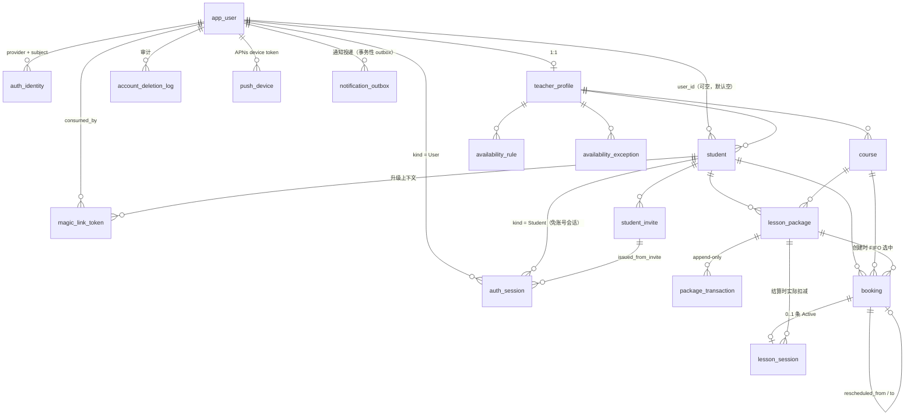

# 数据层设计（PostgreSQL）

> **对应关系**：本文对应 `docs/mvp.md` 的以下章节 —— §5（实体字段、决定 4/5/6、九条不变式）/ §6（课时模型）/ §7.4（四层校验）/ §8（规则快照）/ §10.2–§10.8（关键流程）/ §13（并发与幂等）/ §14（时间）/ §17（可见性）/ §19（US-3 / US-9 / US-10）/ §20（数据保留与**账号删除**）/ §24（开发阶段）；接口契约与错误码对应 `docs/slot-algorithm.md` §6。
>
> **章节号约定**（本文与 `docs/mvp.md` 的章节号大量重载，引用之前请先读这一条）：
>
> - 本文**裸写的 `§X` 一律指本文自身**的章节。引用别的文档时一律带文档名：`docs/mvp.md` §X、`docs/slot-algorithm.md` §X。
> - ⚠️ **同一个 § 号在两份文档里常常是两件不同的事**，下表是最容易读错的几对：
>
> | 本文 | `docs/mvp.md` 的同号章节 |
> |---|---|
> | §1.2 不变式清单的「可执行版本」（负向约束测试） | `docs/mvp.md` §1.2 一句话价值 |
> | §4.2 创建预约的临界区（锁 `student` 行） | `docs/mvp.md` §4.2 学员关系优先于公开流量 |
> | §4.3 I3 交给排他约束：怎么用、错误怎么映射 | `docs/mvp.md` §4.3 一个学员只看到与自己有关的信息 |
> | §5.1 创建预约（事务步骤） | `docs/mvp.md` §5.1 实体关系与关键设计决定 |
> | §5.2 完成课程（幂等） | `docs/mvp.md` §5.2 术语表 |
> | §5.3 撤销完成 | `docs/mvp.md` §5.3 实体字段 |
> | §5.4 取消预约 | `docs/mvp.md` §5.4 不变式清单 |
> | §6.3 写法 B（幂等，按需使用） | `docs/mvp.md` §6.3 消耗顺序（FIFO） |
> | §7.3 定时任务的三条实现纪律 | `docs/mvp.md` §7.3 Slot 生成算法 |
> | §7.4 健康巡检（可选） | `docs/mvp.md` §7.4 可用性判定的四层检查 |
> | §9.2 三条硬要求（迁移：空库可迁移 / 负向测试 / 破坏性变更） | `docs/mvp.md` §9.2 迁移表（Booking 状态迁移） |
>
> - 更完整地说，本文的 §1.1–§1.2、§2.1–§2.4、§3.1–§3.2、§4.1–§4.5、§5.1–§5.4、§6.1–§6.4、§7.1–§7.4、§9.1–§9.5 与 `docs/mvp.md` 的同号章节**全部不同义**；本文其余章节（§0.x、§2.5 及之后、§5.5 及之后、§8.x、§10 与附录）不在 `docs/mvp.md` 的编号范围内。
>
> **一句话结论**：业务语义 —— 课包**批次模型**（`purchased` / `remaining`、FIFO 消耗、`remaining > purchased` 结构上不可能）、`reserved` 与 `available` 是**派生值不落库**、**预约只占额度不扣课时**、改期 = **先取消后创建且单事务**、**迟到取消不创建 Session**、规则快照、Booking 只有三个状态、不物理删除、流水 append-only。这些语义由**数据库约束**承担：八条数据库级不变式 + 一条应用层纯函数（§1）。定时任务（自动结算、状态置位、清理与健康巡检）只做「业务上必须自动发生的事」与「数据库约束管不了的巡检」，**不是正确性的兜底**。代价是数据库运维与迁移纪律。

---

## 0. 选型与部署形态

### 0.1 为什么是 PostgreSQL

不是「因为它是默认答案」，而是因为本项目有**四个只能由数据库给出的保证**，其中第 1 条是决定性的：

| # | 需求 | 只有关系数据库能做到 |
|---|---|---|
| 1 | 同一老师任意两条 `Upcoming` 预约时间不重叠（不变式 I3） | `EXCLUDE USING gist` + 范围类型。这是唯一一个**应用层补不干净**的能力：应用层协议永远要在「检查」与「写入」之间留一个窗口，而消除这个窗口只能用数据库的范围排他约束 |
| 2 | 多表写入的原子性 | 改期 = 取消 + 创建；完成 = 建 Session + 推进状态 + 扣课时。单事务让「半边状态」这个失败模式整体消失 |
| 3 | 金额/课时账的区间不变式 | `CHECK (0 ≤ remaining_sessions ≤ purchased_sessions)`。写不进去，而不是事后发现 |
| 4 | 复杂聚合与导出 | 课时流水导出（`docs/mvp.md` §21 Pro 层）、将来的收入统计（`docs/mvp.md` §25）。SQL 直接写，不需要拼聚合管道 |

### 0.2 托管 vs 自建

| 维度 | 托管（推荐起步：Supabase） | 自建（Docker / 云 RDS） |
|---|---|---|
| 版本与扩展 | PostgreSQL 16；`btree_gist` / `pgcrypto` / `pg_cron` 均可开 | 自己装、自己升级 |
| 连接池 | 内置（transaction mode），Serverless 部署几乎必需 | 自己上 PgBouncer |
| 备份 | 每日备份 + PITR（按档位） | `pgBackRest` / WAL-G + **自己保证恢复演练** |
| 定时 | 平台调度器 / `pg_cron` | 自建 cron / 容器内调度 |
| 迁移 | **仍然必须自己写 SQL migration**，不要在控制台手点（手点的变更不会进仓库，等于没有 schema 历史） | 同 |
| 成本 | 起步低，随数据量与带宽上升 | 固定实例成本 + **人的成本** |
| 数据合规 | 数据出境需要评估 | 可放境内 |
| 锁定风险 | 附属能力（平台自带身份、存储、实时订阅）用多了会被绑住 | 无 |

> **建议：把托管平台当成「一个自带备份、连接池和定时器的 Postgres」，只用它的 Postgres。**
>
> 具体到身份：平台自带的认证服务可以直接给你 `provider + subject`，但**业务表不要外键到平台保留 schema**（例如平台自己的用户表）。本设计用自己的 `app_user` + `auth_identity`（§2.2），认证方式可以交给任何一家，用户映射始终在自己手里。这样将来从托管搬到自建、或换一家托管，**只改连接串**。

### 0.3 需要哪些扩展

| 扩展 | 必须？ | 用途 | 备注 |
|---|---|---|---|
| `btree_gist` | **必须** | 让 `uuid`（`teacher_id WITH =`）和 `smallint`（`weekday WITH =`）能参与 GiST 排他约束 —— I3 与「开放规则不重叠」都靠它 | `tstzrange` / `int4range` 的 GiST opclass 是内置的，**只有**标量 `=` 部分需要它 |
| `pgcrypto` | 可选 | 只有你想在数据库侧用 `gen_random_bytes()` / `digest()` 时才需要 | **`gen_random_uuid()` 不需要它** —— 从 PostgreSQL 13 起已在核心里。本设计的随机数（邀请 token、幂等键）在应用层用 `crypto.randomBytes` 生成更合适 |
| `pg_cron` | 可选 | 纯 SQL 的定时清理（过期邀请置位、幂等记录清理） | 需要跑应用逻辑的任务（自动结算）**不要**放这里，见 §7 |

> ⚠️ **在托管平台上，扩展通常装在独立的 schema 里**（例如 `CREATE EXTENSION btree_gist WITH SCHEMA extensions`）。`EXCLUDE USING gist` 的 operator class 解析走 `search_path`，所以必须确认连接角色的 `search_path` 包含该 schema，否则你会得到一个看起来很莫名其妙的报错：
>
> ```
> ERROR: data type uuid has no default operator class for access method "gist"
> ```
>
> 这**不是**「PostgreSQL 不支持 uuid 排他约束」，而是「没找到 `btree_gist` 提供的 opclass」。看到这个报错先查 `search_path`，别去改数据类型。

### 0.4 连接、会话与池化

**时区必须被显式钉死，但不要用「每次请求执行一条 `SET TIME ZONE`」。**

| 做法 | 评价 |
|---|---|
| 每次取连接后 `SET TIME ZONE 'UTC'` | 在 **transaction 模式**的连接池下**不可靠**：这条 `SET` 可能在事务之间漂到别的客户端，也可能被别的客户端覆盖。单连接直连时可用 |
| 连接串参数 `?options=-c%20timezone%3DUTC` | 可靠，随连接建立生效 |
| `ALTER ROLE app_rw SET timezone = 'UTC'`（或 `ALTER DATABASE ... SET`） | **推荐**。角色级默认值，与连接是否被池化无关 |

同理，以下三件事在 transaction 池化下必须注意：

| 事项 | 结论 |
|---|---|
| 预备语句（prepared statement） | 事务之间会换后端连接。Node 侧不要使用命名预备语句（`node-postgres` 不传 `name`，或把语句缓存设为 0）。这是最典型的「本地全好、线上偶发」的坑 |
| `pg_advisory_xact_lock` | **安全**：随事务结束自动释放。但本设计**不用** advisory lock（见 §4.2），因为需要的串行化可以用一行真实的行锁表达 |
| `pg_advisory_lock`（会话级） | **危险**：连接被复用后锁会泄漏给别的客户端。禁止使用 |
| `SET` / `SET LOCAL` | `SET LOCAL` 在事务内安全；裸 `SET` 不安全（同上） |

会话级超时（角色级设置，属于「防止一次卡顿变成全站卡顿」）：

```sql
ALTER ROLE app_rw SET statement_timeout = '5s';
ALTER ROLE app_rw SET lock_timeout = '2s';
ALTER ROLE app_rw SET idle_in_transaction_session_timeout = '10s';
```

> `idle_in_transaction_session_timeout` 在本设计里很重要：**多表事务意味着一个「开了事务但迟迟不提交」的请求会一直持有 `student` 行锁，把该学员的所有预约操作全部堵死。** 角色级设置的这个超时是这类故障的自动保险，不是可选项。

---

## 1. 不变式保证层级（本文最重要的一节）

`docs/mvp.md` §5.4 的九条不变式，对应的保证层级：

| # | 不变式 | PostgreSQL 保证手段 |
|---|---|---|
| I1 | `0 ≤ remaining_sessions ≤ purchased_sessions` | **DB**：`CHECK package_balance_range`（+ 状态与数值自洽的两条 CHECK） |
| I2 | 一个 Booking 最多一条 `Active` Session | **DB**：部分唯一索引 `session_one_active_per_booking ON lesson_session(booking_id) WHERE status = 'Active'`；外加 `CHECK booking_session_fields`（`Completed` ⟺ 有 `active_session_id`）与复合外键（指向的必须是**本 Booking** 的 Session） |
| **I3** | **同老师任意两条 `Upcoming` 不重叠** | **DB**：`EXCLUDE USING gist (teacher_id WITH =, (tstzrange(start_at, end_at, '[)')) WITH &&) WHERE (status = 'Upcoming')`，需 `btree_gist` |
| I4 | 流水合计 = 余额 | **DB**：唯一写入口（`SECURITY DEFINER` 函数）+ **余额列对应用角色的 `UPDATE` 权限被收回** + 流水 append-only（`REVOKE UPDATE, DELETE` + 触发器） |
| I5 | 被接受的预约检查时 `available ≥ 1`，因此完成后 `available ≥ 0`（**永不为负**） | **DB**：单事务内「先锁 `student` 行 → 再一条语句读出 `remaining`/`reserved`」；必要时升到 `SERIALIZABLE` |
| I6 | 同老师下 `user_id` 唯一（非空时） | **DB**：`UNIQUE (teacher_id, user_id) WHERE user_id IS NOT NULL` |
| I7 | 一个邀请只能消费一次 | **DB**：条件更新 `UPDATE ... WHERE status='Pending' AND expires_at > now()` + `token_hash` 唯一索引 |
| I8 | 改期链条互指、无环 | **DB**：单事务原子性 + 指向未来行的延迟外键 + `CHECK booking_no_self_link`；无环由「`rescheduled_from` 只在插入时指向已存在的旧单」这一写入方向结构性保证 |
| I9 | Booking 完整落在开放区间内 | **App**：slot 纯函数（`docs/slot-algorithm.md` §3），与 L1/L2/L3 共用同一个函数 |

### 1.1 结论

> 这套设计是 **8 条数据库级保证 + 1 条应用层纯函数**。
>
> 其中 I9 留在应用层不是妥协，而是**正确的位置**：「这个时间点是否落在老师的开放区间内」是一条业务规则（`docs/mvp.md` §7.3），它必须与展示/L1、确认/L2 用同一个函数。把它塞进 `CHECK` 只会产生第二套判断逻辑，正是 `docs/mvp.md` §7.4 最反对的事。

### 1.2 不变式清单的「可执行版本」

`docs/mvp.md` §5.4 说这九条「最应该被写成自动化测试」。在 PostgreSQL 下它们就是**负向约束测试**，非常好写：

| 测试 | 断言 |
|---|---|
| 插两条重叠的 `Upcoming`（同老师） | 抛 `23P01` 且 `e.constraint = 'booking_no_overlap'` |
| 插两条**背靠背**的 `Upcoming`（15:00–16:00 与 16:00–17:00） | **成功**（左闭右开 `[)`） |
| 把第二条置 `Cancelled` 后再插 | **成功**（部分排他索引只覆盖 `Upcoming`） |
| 给同一 Booking 插第二条 `Active` Session | 抛 `23505` 且 `e.constraint = 'session_one_active_per_booking'` |
| 把 `remaining_sessions` 改成负数 / 大于 `purchased_sessions` | 抛 `23514` |
| `UPDATE package_transaction ...` / `DELETE FROM package_transaction ...` | 抛 `23001` |
| 两个未绑定学员（`user_id IS NULL`）同时插入 | **成功**（部分唯一索引排除 NULL 行） |
| 同一老师下同一 `user_id` 插第二条 Student | 抛 `23505` 且 `e.constraint = 'student_teacher_user_key'` |
| 把 Booking 的 `active_session_id` 指向另一个 Booking 的 Session | 抛 `23503`（复合外键，§2.9） |
| 免账号消费邀请（`status='Consumed'` 且 `consumed_by_user_id IS NULL`） | **成功**（这是默认路径，`docs/mvp.md` §5.1 决定 5、§5.6.1） |
| 免账号学员写入 `bound_at` 且 `user_id IS NULL` | **成功**（`student_bound_pair` 是单向的，§2.5） |
| 消费魔法链接时不写 `consumed_by_user_id` | 抛 `23514`（`magic_link_consumed_pair` 是双向的 —— 所以 upsert 必须排在消费之前，§5.6.2） |

> **把这张表里的每一条都写成测试，是本文最该被自动化的部分。** 它们同时锁住了「业务语义」和「schema」，任何一次误删约束的迁移都会立刻红灯。测试只需要一个真 PostgreSQL，用两个真连接跑真并发。

**外加一条必须写死的账本回归测试**（它不是约束测试，而是行为测试）：

```
10 purchased / 10 remaining
   → 完成一节课      → 期望 10 / 9
   → 撤销完成        → 期望 10 / 10      ← ★ 写成 GREATEST(amount, 0) 时会得到 11 / 10
   → 再完成一节课    → 期望 10 / 9
   → 再撤销完成      → 期望 10 / 10
```

> 它锁的是 §5.0 那条规则：**`purchased` 的增量由 `type` 决定，不由 `amount` 的符号决定。**
> 用符号去推断（`purchased += GREATEST(amount, 0)`）会让 `REVERSAL` 把 `purchased` 一起抬高，
> 而 `I1`（`remaining ≤ purchased`）**仍然成立**、`tx_sign` 也不会报错 ——
> 这是一类**只能靠行为测试抓住的账本 bug**：账面上多出一节课，谁看都"合法"。

---

## 2. Schema

### 2.0 全表通用约定

- **命名**：表名单数 `snake_case`，与 `docs/mvp.md` §5.3 的实体名一一对应（`User` → `app_user`，`AuthIdentity` → `auth_identity`，`PackageTransaction` → `package_transaction`）。列名与 `docs/mvp.md` §5.3 的字段名一致。**四处刻意的偏差**（都是为了消除歧义，写在下面这张表里）：

| 本文列名 | `docs/mvp.md` §5.3 字段名 | 为什么不一样 |
|---|---|---|
| `availability_rule.start_minute` / `end_minute` | `start_time` / `end_time` | 存的是**本地墙钟分钟数**（`smallint`, 0–1440），不是 `time` 类型。§8 要求三种时间语义不许混用类型，用 `_minute` 让「这不是一个时刻」在列名上就能看出来 |
| `availability_exception.on_date` | `date` | `date` 在 SQL 里是类型名，做列名会让 `select date from ...` 这类语句必须加引号。语义不变：**本地日历上的某一天**，类型就是 `date` |
| `booking.policy_snapshot_free_cancel_hours` | `policy_snapshot` | `docs/mvp.md` §5.3 的 `policy_snapshot` 目前只快照一个值（`free_cancel_hours`）。把快照的内容写进列名，避免将来往同一个列里塞第二种快照时语义漂移 |
| `app_user.id` | `User.id` | 表名 `app_user`（`user` 是保留字），列名一致 |

- **主键**：每张表都有 `id uuid PRIMARY KEY DEFAULT gen_random_uuid()`（例外：`idempotency_record` 的唯一性由「主体 + key」的两条部分唯一索引承担，见 §2.8）。
  - 对外暴露的就是这个 uuid，**不用自增整数**：`docs/mvp.md` §17 要求学员看不到别人的数据，uuid 让「改 id 猜数据」这条路直接断掉；同时它允许客户端**预先生成 id** —— 改期事务用到了这一点（§5.5）。
- **枚举标签沿用 `docs/mvp.md` §5.3 的原始拼写**（`'Upcoming'`、`'Used Up'`、`'FREE_CANCEL'`、`'apple'` / `'email'` …），不在 DB 与 API 之间再做一次映射 —— 少一层映射就少一类 bug。代价是 SQL 里遇到含空格的标签必须带引号，仅此而已。
- **时间列**：瞬时一律 `timestamptz`；「本地日历上的某一天」用 `date`；「本地墙钟的某个时刻」用 `smallint` 分钟数（`availability_rule.start_minute`）。三种语义**不许混用同一种类型**，见 §8。
- **没有 `deleted_at`**：`docs/mvp.md` §20 的规则是「用状态表达」，物理删除只允许发生在明确列举的四张表上（`availability_exception`、`student_invite`，以及**无任何引用时**的 `course` / `student` / `lesson_package`）。「无任何引用」这件事由外键的 `ON DELETE RESTRICT` 直接实现，**不需要写检查代码**。
- **所有约束显式命名**，前缀是表名（`booking_no_overlap`、`package_balance_range`）。这不是洁癖：错误映射要靠 `e.constraint` 分辨 23505/23514 的具体含义，约束名是**唯一稳定的抓手**。见 §5.0 的错误映射表与 §9。
- **外键一律 `ON DELETE RESTRICT`**（默认的 `NO ACTION` 行为类似，显式写出是为了让「不物理删除」这条规则在 schema 里就能被看见）。**不使用 `CASCADE`**。

### 2.1 枚举类型

```sql
CREATE TYPE user_status        AS ENUM ('Active', 'Suspended', 'Deleted');   -- Deleted 见 §2.2b
CREATE TYPE auth_provider      AS ENUM ('apple', 'email');                    -- `docs/mvp.md` §5.3 用小写
CREATE TYPE auth_session_kind  AS ENUM ('User', 'Student');                   -- 见 §2.2c
CREATE TYPE deletion_status    AS ENUM ('Completed', 'Failed');
CREATE TYPE magic_link_status  AS ENUM ('Pending', 'Consumed', 'Expired', 'Revoked');
CREATE TYPE magic_link_purpose AS ENUM ('StudentSignIn', 'TeacherSignIn');
CREATE TYPE teacher_status     AS ENUM ('Active', 'Suspended');
CREATE TYPE course_status      AS ENUM ('Active', 'Archived');
CREATE TYPE rule_status        AS ENUM ('Active', 'Deleted');
CREATE TYPE student_status     AS ENUM ('Active', 'Inactive');
CREATE TYPE invite_status      AS ENUM ('Pending', 'Consumed', 'Expired', 'Revoked');
CREATE TYPE package_status     AS ENUM ('Active', 'Used Up', 'Archived');
-- 流水类型分成两簇。这不是命名偏好，而是账本语义本身（见 §2.6 的 tx_sign 与 §5.0）：
--   ①「购买量」簇：PACKAGE_CREATED / MANUAL_ADD / PURCHASE_ADJUSTMENT
--       → purchased 与 remaining **同向变动**（这一批的购买量确实变了）
--   ②「余额」簇：其余全部（含 REVERSAL）
--       → 只动 remaining，**purchased 一动不动**
-- ⚠️ 不要用 amount 的符号去推断该不该抬 purchased：REVERSAL 是正数，但它绝不能抬。
CREATE TYPE package_tx_type    AS ENUM ('PACKAGE_CREATED', 'MANUAL_ADD', 'PURCHASE_ADJUSTMENT',
                                        'BALANCE_ADJUSTMENT',
                                        'SESSION_COMPLETED', 'LATE_CANCEL', 'MANUAL_DEDUCT',
                                        'REVERSAL');
CREATE TYPE booking_status     AS ENUM ('Upcoming', 'Completed', 'Cancelled');
CREATE TYPE booking_source     AS ENUM ('SelfBooked', 'TeacherCreated');
CREATE TYPE cancelled_by       AS ENUM ('Teacher', 'Student', 'System');
CREATE TYPE cancellation_policy AS ENUM ('FREE_CANCEL', 'LATE_CANCEL', 'TEACHER_CANCEL');
CREATE TYPE session_status     AS ENUM ('Active', 'Voided');
CREATE TYPE session_source     AS ENUM ('TeacherConfirmed', 'AutoSettled');
CREATE TYPE idem_state         AS ENUM ('InProgress', 'Succeeded', 'Failed');
CREATE TYPE issue_severity     AS ENUM ('warn', 'error');
```

> `System` 在 MVP 里**不用**（自动结算是 `Completed`，不是 `Cancelled`，`docs/mvp.md` §9.2），保留是为了将来出现「系统清理」路径时不必改枚举类型 —— 改枚举类型要重建类型并锁表，是少数几个「现在多写一个值、将来省一次停机」的地方。
>
> 反过来，**Free / Pro 的功能差异（`docs/mvp.md` §21）绝对不要写进枚举或 CHECK**。它是商业规则，写进 schema 会让每次调价都变成一次数据库迁移。

### 2.2 身份：`app_user` / `auth_identity` / `auth_session` / `magic_link_token`

对应 `docs/mvp.md` §5.1 的**决定 4（身份与账号解耦）** 与**决定 5（学员默认没有账号）**。表名说明：`docs/mvp.md` §5.1/`docs/mvp.md` §5.3 的实体 `User` 落到表 `app_user`（`user` 是 SQL 保留字），`AuthIdentity` 落到 `auth_identity`。

四张表的分工：

```
app_user        业务身份的锚点（= `docs/mvp.md` §5.1 决定 4 的 User）。所有业务表外键指向它，
  │             不指向任何外部身份提供商
  ├─ auth_identity       (provider, subject) → user。一个 user 可以挂多个登录方式（决定 4）
  ├─ auth_session        会话：老师端（kind='User'）与**免账号学员**（kind='Student'，决定 5）
  ├─ magic_link_token    邮箱魔法链接（一次性、短 TTL、只存哈希）：学员「升级为账号」＋找回访问
  └─ account_deletion_log 账号删除的可审计记录（`docs/mvp.md` §20.1）
```

```sql
CREATE TABLE app_user (
  id         uuid PRIMARY KEY DEFAULT gen_random_uuid(),
  nickname   text,                                    -- `docs/mvp.md` §5.3 的 nickname
  avatar     text,                                    -- `docs/mvp.md` §5.3 的 avatar
  status     user_status NOT NULL DEFAULT 'Active',   -- Active / Suspended / Deleted
  deleted_at timestamptz,
  created_at timestamptz NOT NULL DEFAULT now(),
  updated_at timestamptz NOT NULL DEFAULT now(),
  CONSTRAINT app_user_nickname_ck CHECK (nickname IS NULL OR length(btrim(nickname)) BETWEEN 1 AND 60),
  CONSTRAINT app_user_deleted_ck  CHECK ((status = 'Deleted') = (deleted_at IS NOT NULL))
);

CREATE TABLE auth_identity (
  id            uuid PRIMARY KEY DEFAULT gen_random_uuid(),
  user_id       uuid NOT NULL REFERENCES app_user(id) ON DELETE RESTRICT,
  provider      auth_provider NOT NULL,
  subject       text NOT NULL,          -- Apple 的 sub / 规范化后的邮箱
  email         text,                   -- 展示与送达用；Apple 只在首次授权返回
  created_at    timestamptz NOT NULL DEFAULT now(),
  last_login_at timestamptz,
  CONSTRAINT auth_identity_provider_subject_key UNIQUE (provider, subject),
  CONSTRAINT auth_identity_subject_not_blank CHECK (length(btrim(subject)) > 0),
  CONSTRAINT auth_identity_email_normalized  CHECK (email IS NULL OR email = lower(email))
);
CREATE INDEX auth_identity_user_idx ON auth_identity (user_id);

CREATE TABLE magic_link_token (
  id                  uuid PRIMARY KEY DEFAULT gen_random_uuid(),
  token_hash          bytea NOT NULL,          -- sha256(明文 token)，明文只在签发时返回一次
  email               text NOT NULL,
  purpose             magic_link_purpose NOT NULL DEFAULT 'StudentSignIn',
  invite_token_hash   bytea,                   -- 绑定上下文 A：从邀请链接直接选择「用邮箱登录」
  student_id          uuid REFERENCES student(id) ON DELETE RESTRICT,
                                               -- 绑定上下文 B：已有免账号会话的学员「升级为账号」
  status              magic_link_status NOT NULL DEFAULT 'Pending',
  expires_at          timestamptz NOT NULL,
  consumed_at         timestamptz,
  consumed_by_user_id uuid REFERENCES app_user(id) ON DELETE RESTRICT,
  requested_ip        inet,
  created_at          timestamptz NOT NULL DEFAULT now(),
  CONSTRAINT magic_link_hash_key        UNIQUE (token_hash),
  CONSTRAINT magic_link_email_normalized CHECK (email = lower(email)),
  -- 双向：魔法链接的用途就是「确定一个 User」，所以两个字段必然同时有值。
  -- 代价是消费必须写在 user upsert **之后**（见 §5.6.2 的语句顺序）。
  CONSTRAINT magic_link_consumed_pair    CHECK ((consumed_at IS NULL) = (consumed_by_user_id IS NULL)),
  CONSTRAINT magic_link_consumed_status  CHECK (status <> 'Consumed' OR consumed_at IS NOT NULL),
  CONSTRAINT magic_link_ttl              CHECK (expires_at > created_at)
);
CREATE INDEX magic_link_email_idx   ON magic_link_token (email, created_at DESC);
CREATE INDEX magic_link_expires_idx ON magic_link_token (expires_at) WHERE status = 'Pending';
```

**为什么身份要自己建表，而不是用托管平台的用户表**：`app_user` 是所有业务外键的目标，它一旦指向平台保留 schema，备份、迁移、换托管商都会被绑住（§0.2）。

> ⚠️ **Sign in with Apple 的两个必踩点**（老师端）：
>
> 1. **姓名与邮箱只在首次授权返回**，之后的登录只有 `sub`。所以首次登录必须把 `nickname` / `email` 落库（`auth_identity.email` + `app_user.nickname`），否则永远拿不回来。不要写「每次登录都从 Apple 刷新资料」这种代码。
> 2. **`sub` 是唯一稳定标识**，邮箱可能变、可能是 Hide My Email 的中继地址。**唯一键永远是 `(provider, subject)`**，邮箱只当作展示与送达字段。
>
> 服务端校验 `identityToken` 时必须验签（Apple 公钥 JWKS）、校验 `aud`（自己的 bundle id）与 `iss`，并把 `sub` 当作不可信输入之外的东西处理 —— 这段代码是老师端唯一的身份入口，写错了整个「一个学员只看到自己的数据」（`docs/mvp.md` §4.3）就没了。

> ⚠️ **邮箱魔法链接最经典的坑：邮箱安全扫描器会自动 GET 邮件里的链接。** 如果 GET 就消费 token，链接会在用户点到之前被「用掉」，用户看到「链接已失效」。
>
> 因此消费必须是**两步**：
> 1. `GET /v1/auth/magic/{token}` —— **只校验、只渲染确认页，不消费**。
> 2. `POST /v1/auth/magic/{token}/confirm` —— 用户点「确认登录」时才消费。
>
> 另外：签发接口无论邮箱是否存在都返回同一个响应（**不泄露账号是否存在**），并按邮箱与 IP 双维度限流。
>
> **魔法链接是可选升级与找回路径**：学员的默认路径是「免账号」（§2.2c），所以魔法链接不是入口，而是**可选升级与找回**。这带来一个正好相反的要求：**它必须容忍「先用了半年再升级」**。所以签发时不要求邮箱与老师录入的姓名有任何关系，绑定后老师端只显示「已绑定 · 账号邮箱 XXX」供人工核对（`docs/mvp.md` §10.2）。

### 2.2b 账号删除：删身份，不删账

`docs/mvp.md` §20.1 的要求：App Store 审核 5.1.1(v) 强制要求 App 内可删号，而 `docs/mvp.md` §20 要求业务数据不物理删除。**两者不冲突，因为删的不是同一个东西** —— 删身份，不删账。

```sql
CREATE TABLE account_deletion_log (
  id           uuid PRIMARY KEY DEFAULT gen_random_uuid(),
  user_id      uuid NOT NULL,                  -- 不加外键：它是审计记录，账号已匿名化后仍要可读
  requested_by uuid NOT NULL,
  status       deletion_status NOT NULL,
  detail       text,
  created_at   timestamptz NOT NULL DEFAULT now(),
  CONSTRAINT account_deletion_detail_ck CHECK (status = 'Completed' OR detail IS NOT NULL)
);
CREATE INDEX account_deletion_log_created_idx ON account_deletion_log (created_at DESC);
```

删除动作 = **匿名化 + 停用**，一个事务，**没有任何 `DELETE`**：

```sql
-- ① 账号立即失效
UPDATE app_user SET status='Deleted', deleted_at=now(), nickname=NULL, avatar=NULL, updated_at=now()
 WHERE id=$1;

-- ② 身份标识不可逆处理：subject 换成哈希（保留唯一性以阻止重放/重复注册），邮箱清空
UPDATE auth_identity
   SET subject = 'deleted:' || encode(sha256(convert_to(subject, 'UTF8')), 'hex'),
       email   = NULL
 WHERE user_id=$1;

-- ③ 老师资料匿名化（`docs/mvp.md` §20.1）
UPDATE teacher_profile SET name='已注销用户', avatar=NULL, bio=NULL, status='Suspended', updated_at=now()
 WHERE user_id=$1;

-- ④ 会话全部失效（§2.2c）
UPDATE auth_session SET revoked_at=now() WHERE user_id=$1 AND revoked_at IS NULL;

-- ⑤ 审计记录（`docs/mvp.md` §19 US-9 的「谁、何时、删了什么」）
INSERT INTO account_deletion_log (user_id, requested_by, status) VALUES ($1, $1, 'Completed');
```

> **必须保留的业务记录**：`booking` / `lesson_session` / `lesson_package` / `package_transaction` / `student`。理由（`docs/mvp.md` §20.1）：课时账是**交易双方共有的**，不能因为一方注销而消失 —— 学员还剩几节课、老师已经上过几节课，都必须可查。
>
> ⚠️ **三个容易做错的地方**：
>
> **① 不要 `DELETE FROM app_user`。** 它是所有业务表的外键目标（`ON DELETE RESTRICT` 会直接拒绝），而正确的做法本来就是保留行、清空字段。
>
> **② `subject` 必须保留唯一性**（哈希后仍是唯一值）。同一个人用同一个 Apple ID 再次登录时，我们要能识别出「这条身份属于一个已注销账号」，从而按策略拒绝或建一个干净账号。**把 `subject` 直接置 NULL 会破坏唯一键，也会让重复登录检测失效。** 代价是**登录时的身份查找必须查两种形式**：
>
> ```sql
> SELECT * FROM auth_identity
>  WHERE provider = $1
>    AND subject IN ($2, 'deleted:' || encode(sha256(convert_to($2, 'UTF8')), 'hex'));
> ```
>
> 命中哈希形式 ⇒ 该身份已注销：**不要把它「复活」成原账号**（那等于绕过删号），而是走「同意条款 → 新建一个干净的 `app_user`」，或直接拒绝。**这一步漏了，删号就只是改了个名字。**
>
> **③ 删除必须在 App 里二次确认并写明后果**（`docs/mvp.md` §19 US-9、`docs/mvp.md` §15.3）。这条要求在数据层的对应物就是 `teacher_profile.name = '已注销用户'` —— 学员端仍然能看到「这门课的老师存在」，但看不到任何可识别身份。
>
> 另外：**匿名化不等于删除备份里的数据**。备份保留窗口内的副本仍含原值，这一点必须写进隐私政策（`docs/mvp.md` §15.3 第 13 条），不能含糊。

### 2.2c 会话：免账号学员（`docs/mvp.md` §5.1 决定 5）怎么获得身份

`docs/mvp.md` §5.1 决定 5 的关键句是：**「邀请 token 就是身份」**，`student.user_id` **允许长期为空，这是默认状态，不是异常状态**。

于是身份有两种主体，会话必须同时表达它们：

| 主体 | 谁 | 会话里的身份 | `student.user_id` |
|---|---|---|---|
| **`User`** | 老师；**已升级的**学员 | `auth_session.user_id` | 已升级学员 → 有值 |
| **`Student`** | **免账号**学员（默认路径） | `auth_session.student_id` + `teacher_id` 作用域 | **保持 NULL** |

```sql
CREATE TABLE auth_session (
  id                  uuid PRIMARY KEY DEFAULT gen_random_uuid(),
  token_hash          bytea NOT NULL,           -- sha256(长效 refresh token)；cookie 里放明文，access token 是短期 JWT、不落库
  kind                auth_session_kind NOT NULL,
  user_id             uuid REFERENCES app_user(id) ON DELETE RESTRICT,
  student_id          uuid REFERENCES student(id) ON DELETE RESTRICT,
  teacher_id          uuid REFERENCES teacher_profile(id) ON DELETE RESTRICT,  -- Student 会话的作用域
  issued_from_invite  uuid REFERENCES student_invite(id) ON DELETE RESTRICT,   -- 审计：哪个邀请换来的
  expires_at          timestamptz NOT NULL,
  revoked_at          timestamptz,
  created_at          timestamptz NOT NULL DEFAULT now(),
  last_seen_at        timestamptz,
  CONSTRAINT auth_session_hash_key    UNIQUE (token_hash),
  CONSTRAINT auth_session_subject_ck CHECK ((kind = 'User') = (user_id IS NOT NULL)),
  CONSTRAINT auth_session_student_ck CHECK ((kind = 'Student') = (student_id IS NOT NULL)),
  CONSTRAINT auth_session_scope_ck   CHECK ((kind = 'Student') = (teacher_id IS NOT NULL)),
  CONSTRAINT auth_session_ttl_ck     CHECK (expires_at > created_at)
);
CREATE INDEX auth_session_user_idx    ON auth_session (user_id) WHERE revoked_at IS NULL;
CREATE INDEX auth_session_student_idx ON auth_session (student_id) WHERE revoked_at IS NULL;
CREATE INDEX auth_session_expires_idx ON auth_session (expires_at) WHERE revoked_at IS NULL;
```

> ⚠️ **为什么用一张会话表，而不是「一个长效 JWT 就够了」**：
>
> 免账号学员**没有**密码、没有邮箱、没有 Apple ID，**也没有第二个可以重新拿到访问权的东西**（邀请 token 是一次性的，用过即 `Consumed`）。所以这个会话是**唯一的访问凭证**，它必须满足两个 JWT 做不到的事：
>
> 1. **可撤销**：老师作废学员 / 学员删号（§2.2b）/ 发现泄露时，必须能立即失效。无状态 JWT 只能等它过期，或者额外维护一张黑名单 —— 那张黑名单就是这张表。
> 2. **可续期**：学员每次进来都不该重新点邀请（`docs/mvp.md` §5.1 决定 5 的说法是「把摩擦从每一次进入降级为极少数情况下的一次找回」）。滑动续期需要写 `last_seen_at` / 延长 `expires_at`，这本身就需要一行记录。
>
> 会话过期设得**长**（例如 180 天 + 每次访问滑动续期）：这个 cookie 就是学员的全部访问权，短 TTL 会让「免账号」这个设计的代价（清数据就要找老师）提前发生。老师端 iOS 的会话可以用较短的 JWT + 刷新令牌，因为 Apple 登录随时能重来。
>
> **`kind='User'` 里既有老师也有「已升级的学员」** —— 服务端靠「`teacher_profile.user_id = 我` 是否存在」来区分能力，**不要在会话或 JWT 里写死角色**：按 `docs/mvp.md` §5.1 决定 1，老师也可以是别的老师的学员，角色是关系而不是身份属性。把角色写进凭证，等于把这条数据模型能力提前堵死。

> ⚠️ **每一次学员侧查询都必须同时带 `student_id` 与 `teacher_id` 两个作用域条件。**
>
> ```
> ✅ WHERE b.student_id = $session.student_id
> ❌ WHERE b.student_id = $1        -- 只按 student_id 查，忘了 teacher 作用域
> ```
>
> `Student` 会话的 `student_id` 已经唯一确定了 (老师, 学员) 这一对，所以按 `student_id` 查其实已经足够；**但显式带上 `teacher_id` 是一层廉价的自检** —— 它能挡住「会话里的 `student_id` 与当前页面上的 `teacher_id` 不一致」这类拼接错误（也就是越权）。见 §3.4。

> ⚠️ **匿名会话一次只服务一个老师关系（`docs/mvp.md` §5.1 决定 6）。**
>
> `Student` 会话唯一确定了「(老师, 学员)」这一对，**它不含任何跨老师的自然人身份**。
> 因此服务端在默认路径上**无法**把 A 老师名下的 `Student 123` 与 B 老师名下的 `Student 456` 归到同一个人身上 —— 这不是实现疏漏，而是"免账号"的固有含义。
>
> 直接后果：`GET /v1/me/student-home` 在匿名会话下**恒为一张卡片**（`docs/impl-guide.md` §5.8）。只有会话 `kind='User'`（学员升级为账号、`student.user_id` 被回填）之后，才可能返回多张卡片。
>
> **不要为了支持多老师去建"设备侧的匿名身份聚合"。** 那等于在客户端重建一套 identity，正是 `docs/mvp.md` §5.1 决定 6 明确排除的方案。

### 2.3 老师：`teacher_profile`

```sql
CREATE TABLE teacher_profile (
  id                 uuid PRIMARY KEY DEFAULT gen_random_uuid(),
  user_id            uuid NOT NULL REFERENCES app_user(id) ON DELETE RESTRICT,
  name               text NOT NULL,
  avatar             text,
  bio                text,
  timezone           text NOT NULL DEFAULT 'Asia/Shanghai',
  slot_step_minutes  integer NOT NULL DEFAULT 30,
  min_lead_hours     integer NOT NULL DEFAULT 2,
  max_advance_days   integer NOT NULL DEFAULT 30,
  free_cancel_hours  integer NOT NULL DEFAULT 24,
  auto_settle_hours  integer NOT NULL DEFAULT 24,
  undo_complete_days integer NOT NULL DEFAULT 7,
  max_reschedules    integer NOT NULL DEFAULT 3,
  status             teacher_status NOT NULL DEFAULT 'Active',
  created_at         timestamptz NOT NULL DEFAULT now(),
  updated_at         timestamptz NOT NULL DEFAULT now(),
  CONSTRAINT teacher_user_key        UNIQUE (user_id),          -- `docs/mvp.md` §5.3 的 1:1
  CONSTRAINT teacher_name_not_blank  CHECK (length(btrim(name)) BETWEEN 1 AND 40),
  CONSTRAINT teacher_timezone_mvp    CHECK (timezone = 'Asia/Shanghai'),
  CONSTRAINT teacher_step_ck         CHECK (slot_step_minutes IN (15, 20, 30, 60)),
  CONSTRAINT teacher_lead_ck         CHECK (min_lead_hours IN (0, 1, 2, 6, 12, 24)),
  CONSTRAINT teacher_advance_ck      CHECK (max_advance_days IN (7, 14, 30, 60)),
  CONSTRAINT teacher_free_cancel_ck  CHECK (free_cancel_hours IN (6, 12, 24, 48)),
  CONSTRAINT teacher_auto_settle_ck  CHECK (auto_settle_hours BETWEEN 0 AND 168),
  CONSTRAINT teacher_undo_days_ck    CHECK (undo_complete_days BETWEEN 0 AND 30),
  CONSTRAINT teacher_reschedules_ck  CHECK (max_reschedules BETWEEN 0 AND 20)
);
CREATE INDEX teacher_status_idx ON teacher_profile (status);
```

> `teacher_timezone_mvp` 这条 CHECK 是**刻意**的：`docs/mvp.md` §14 说「MVP 固定 `Asia/Shanghai`，`timezone` 字段保留」。与其让一个没人维护的字段悄悄漂移（然后某天有人把它改成 `America/New_York` 而没有任何代码支持），不如让它现在写不进去。将来真做多时区时，删掉这一行就是一次 migration。

### 2.4 课程与开放时间：`course` / `availability_rule` / `availability_exception`

```sql
CREATE TABLE course (
  id                 uuid PRIMARY KEY DEFAULT gen_random_uuid(),
  teacher_id         uuid NOT NULL REFERENCES teacher_profile(id) ON DELETE RESTRICT,
  name               text NOT NULL,
  duration_minutes   integer NOT NULL,
  allow_self_booking boolean NOT NULL DEFAULT true,
  status             course_status NOT NULL DEFAULT 'Active',
  created_at         timestamptz NOT NULL DEFAULT now(),
  updated_at         timestamptz NOT NULL DEFAULT now(),
  CONSTRAINT course_name_not_blank CHECK (length(btrim(name)) BETWEEN 1 AND 60),
  CONSTRAINT course_duration_ck    CHECK (duration_minutes BETWEEN 15 AND 240),  -- `docs/mvp.md` §7.3
  CONSTRAINT course_id_teacher_key UNIQUE (id, teacher_id)                        -- 供 §2.9 的复合外键
);
CREATE INDEX course_teacher_status_idx ON course (teacher_id, status);
```

```sql
CREATE TABLE availability_rule (
  id           uuid PRIMARY KEY DEFAULT gen_random_uuid(),
  teacher_id   uuid NOT NULL REFERENCES teacher_profile(id) ON DELETE RESTRICT,
  weekday      smallint NOT NULL,        -- ISO-8601：1=周一 … 7=周日
  start_minute smallint NOT NULL,        -- 本地墙钟分钟数 0..1440，不是 time、不是 timestamptz
  end_minute   smallint NOT NULL,
  status       rule_status NOT NULL DEFAULT 'Active',
  created_at   timestamptz NOT NULL DEFAULT now(),
  updated_at   timestamptz NOT NULL DEFAULT now(),
  CONSTRAINT rule_weekday_ck     CHECK (weekday BETWEEN 1 AND 7),
  CONSTRAINT rule_minutes_range  CHECK (start_minute >= 0 AND end_minute <= 1440),
  CONSTRAINT rule_same_day       CHECK (start_minute < end_minute),      -- `docs/mvp.md` §7.1 不支持跨天
  CONSTRAINT rule_minute_grid    CHECK (start_minute % 5 = 0 AND end_minute % 5 = 0),
  -- `docs/mvp.md` §7.3 步骤 ④ 的「防御性去重」在 PostgreSQL 下不需要了：同老师同 weekday 的 Active 规则不允许重叠
  CONSTRAINT rule_no_overlap EXCLUDE USING gist (
    teacher_id WITH =,
    weekday    WITH =,
    (int4range(start_minute, end_minute, '[)')) WITH &&
  ) WHERE (status = 'Active')
);
CREATE INDEX rule_teacher_weekday_idx ON availability_rule (teacher_id, weekday, status);
```

> **`rule_no_overlap` 是「把配置错误变成写不进去」的一个额外例子。** 开放规则不得重叠由数据库直接禁止；`docs/mvp.md` §7.3 的算法里那个「去重（防御性）」步骤可以保留（成本为零、纯函数内部去重），但**它不是正确性依赖**。
>
> **关于 `rule_minute_grid`（5 分钟网格）**：这条 CHECK 的价值在**展示与排障** —— 所有 slot 起点都落在 5 分钟网格上，看日志和截图时一眼能认出「14:07 这种时间一定是 bug」。I3 由排他约束保证，所以**对齐不是正确性前提**，这条 CHECK 是可选的：如果你觉得它束缚了老师的输入（例如想开 14:10 的班），删掉它不影响任何不变式。

```sql
CREATE TABLE availability_exception (
  id           uuid PRIMARY KEY DEFAULT gen_random_uuid(),
  teacher_id   uuid NOT NULL REFERENCES teacher_profile(id) ON DELETE RESTRICT,
  on_date      date NOT NULL,            -- 本地日期。date 类型，不用 timestamptz（§8）
  start_minute smallint,                 -- 两个都为 NULL = 整天关闭（`docs/mvp.md` §7.2）
  end_minute   smallint,
  reason       text,
  created_at   timestamptz NOT NULL DEFAULT now(),
  CONSTRAINT exc_pair_ck CHECK ((start_minute IS NULL) = (end_minute IS NULL)),
  CONSTRAINT exc_range_ck CHECK (
    start_minute IS NULL
    OR (start_minute >= 0 AND start_minute < end_minute AND end_minute <= 1440)),
  CONSTRAINT exc_reason_ck CHECK (reason IS NULL OR reason IN ('vacation', 'personal'))
);
CREATE INDEX exc_teacher_date_idx ON availability_exception (teacher_id, on_date);
```

> **已存在的 Booking 不受 Exception 影响（`docs/mvp.md` §7.2）不是一条约束，而是算法性质**：Exception 只参与 `docs/mvp.md` §7.3 的 slot 生成，从不触碰 `booking`。这是**结构性的**（没有任何代码路径会因 Exception 去改 Booking），所以这里也不需要「Exception 变更时重算已有数据」的补偿逻辑。
>
> **`docs/mvp.md` §20 允许 `availability_exception` 硬删除**，而且它是少数几个**真的可以**硬删除的表：它的语义是「未来的关闭窗口」，没有任何历史数据引用它，删掉不影响任何已存在的 Booking。`student_invite` 同理。

### 2.5 学员与邀请：`student` / `student_invite`

```sql
CREATE TABLE student (
  id         uuid PRIMARY KEY DEFAULT gen_random_uuid(),
  teacher_id uuid NOT NULL REFERENCES teacher_profile(id) ON DELETE RESTRICT,
  user_id    uuid REFERENCES app_user(id) ON DELETE RESTRICT,   -- 可空，且**为空是默认状态**（免账号学员，`docs/mvp.md` §5.1 决定 5）
  name       text NOT NULL,
  contact    text,
  status     student_status NOT NULL DEFAULT 'Active',
  bound_at   timestamptz,
  created_at timestamptz NOT NULL DEFAULT now(),
  updated_at timestamptz NOT NULL DEFAULT now(),
  CONSTRAINT student_name_not_blank CHECK (length(btrim(name)) BETWEEN 1 AND 40),
  -- 单向：有账号 ⇒ 一定有绑定时间；反之不成立
  -- （免账号学员有 bound_at、user_id 保持 NULL —— 这是默认状态，见 `docs/mvp.md` §5.1 决定 5 与 §5.6.1）
  CONSTRAINT student_bound_pair     CHECK (user_id IS NULL OR bound_at IS NOT NULL),
  CONSTRAINT student_id_teacher_key UNIQUE (id, teacher_id)     -- 供 §2.9 的复合外键
);

-- I6：同一老师下 user_id 唯一（非空时）
CREATE UNIQUE INDEX student_teacher_user_key
  ON student (teacher_id, user_id) WHERE user_id IS NOT NULL;

CREATE INDEX student_teacher_status_name_idx ON student (teacher_id, status, name);
CREATE INDEX student_user_idx ON student (user_id) WHERE user_id IS NOT NULL;
```

> ⚠️ **读这张表时先把这个语义装进脑子**：`user_id IS NULL` **不是「还没绑定」这个过渡状态，而是默认的稳态**（`docs/mvp.md` §5.1 决定 5）。老师建完学员、发完邀请、学员接受邀请并开始约课，全程 `user_id` 都可以是空的。**只有学员主动「升级为账号」之后它才有值。** 所以任何形如「先看学员有没有绑定，没有就引导他去绑定」的代码都是错的 —— 那会把默认路径当成异常。
>
> 这也决定了 I6 的**范围**：它只约束「有账号的学员」（`WHERE user_id IS NOT NULL`）。免账号学员之间的唯一性由「一个 Student 一条记录 + 邀请 token 绑定到具体 `student_id`」保证，与 `user_id` 无关。

> **I6 的形状直接由部分唯一索引表达**：`UNIQUE (teacher_id, user_id) WHERE user_id IS NOT NULL`。
>
> `WHERE user_id IS NOT NULL` 让所有**免账号学员**（`user_id` 为 NULL 的行）都不进入索引，因此任意多个尚未绑定账号的学员可以共存；「同一老师下 `user_id` 唯一」只对**有账号的学员**生效 —— 这正是 I6 的范围。
>
> ⚠️ **不要用 PostgreSQL 15+ 的 `UNIQUE NULLS NOT DISTINCT (teacher_id, user_id)`。** 它会把所有 `user_id` 为 NULL 的学员视为同一个值，未绑定学员互相冲突，**直接违反上面那条默认路径**。

> **「一个 Student 只能绑一个 User」不需要额外索引**：`student.user_id` 是单列，一条 Student 只可能有一个 `user_id`。I6 管的是反方向。

```sql
CREATE TABLE student_invite (
  id                  uuid PRIMARY KEY DEFAULT gen_random_uuid(),
  teacher_id          uuid NOT NULL,
  student_id          uuid NOT NULL,
  token_hash          bytea NOT NULL,       -- sha256(raw token)；明文只在签发时返回一次
  status              invite_status NOT NULL DEFAULT 'Pending',
  expires_at          timestamptz NOT NULL, -- 默认签发后 7 天（`docs/mvp.md` §10.2）
  consumed_by_user_id uuid REFERENCES app_user(id) ON DELETE RESTRICT,
  consumed_at         timestamptz,
  created_at          timestamptz NOT NULL DEFAULT now(),
  CONSTRAINT invite_token_hash_key     UNIQUE (token_hash),
  -- 单向：记了人就必须有时间；反之不成立 —— **免账号消费邀请时 consumed_by_user_id 就是 NULL**，
  -- 那是默认路径（`docs/mvp.md` §5.1 决定 5），不是异常。写成双向会直接把默认路径挡在门外。
  CONSTRAINT invite_consumed_pair      CHECK (consumed_by_user_id IS NULL OR consumed_at IS NOT NULL),
  CONSTRAINT invite_consumed_status    CHECK (status <> 'Consumed' OR consumed_at IS NOT NULL),
  CONSTRAINT invite_ttl                CHECK (expires_at > created_at),
  CONSTRAINT invite_student_fk FOREIGN KEY (student_id, teacher_id)
    REFERENCES student(id, teacher_id) ON DELETE RESTRICT
);
CREATE INDEX invite_student_status_idx ON student_invite (student_id, status);

-- 🔸 超出 `docs/mvp.md` §5.4 清单的一条新保证：一个 Student 同时最多一条 Pending 邀请
CREATE UNIQUE INDEX invite_one_pending_per_student
  ON student_invite (student_id) WHERE status = 'Pending';
```

> **为什么邀请也存哈希**：`docs/mvp.md` §10.2 要求 token「一次性、不可猜测（≥128 bit 随机）」。只存 `sha256` 意味着**数据库泄露不等于邀请可被使用**，与密码同理。明文只在签发时返回一次给老师端。
>
> **被转发给第三人**（`docs/mvp.md` §10.2）由 I7 的条件更新直接处理：邀请已被消费 → 更新命中 0 行 → 返回明确的「该邀请已被使用，请联系老师重新发送」。**不做「谁先点谁绑定」。**
>
> **🔸 `invite_one_pending_per_student` 是本文新增的一条保证**（`docs/mvp.md` §5.4 没有）。依据是 `docs/mvp.md` §10.2 的重发规则：「旧的置 `Revoked`，签发新 token」—— 也就是说业务上本来就不允许两条 Pending 并存。把它写成部分唯一索引有两个好处：`GET /invites/{token}` 不会在两条 Pending 之间产生歧义；重发必须走「先 `Revoked` 后插入」的单事务（在 PostgreSQL 里这是两条语句，本来也应该是原子的）。**如果产品上希望保留「多条 Pending 同时有效」，删掉这个索引即可，I7 不受影响。**

### 2.6 课包：`lesson_package` / `package_transaction`

```sql
CREATE TABLE lesson_package (
  id                 uuid PRIMARY KEY DEFAULT gen_random_uuid(),
  teacher_id         uuid NOT NULL REFERENCES teacher_profile(id) ON DELETE RESTRICT,
  student_id         uuid NOT NULL,
  course_id          uuid NOT NULL,
  purchased_sessions integer NOT NULL,     -- 本批次累计购买/发放。只由「购买量」簇流水改动（§2.1）
  remaining_sessions integer NOT NULL,     -- 当前余额（唯一权威值）
  status             package_status NOT NULL DEFAULT 'Active',
  created_at         timestamptz NOT NULL DEFAULT now(),
  updated_at         timestamptz NOT NULL DEFAULT now(),
  archived_at        timestamptz,

  -- I1：余额区间。这是「写不进去」而不是「事后发现」
  CONSTRAINT package_balance_range    CHECK (remaining_sessions >= 0
                                         AND remaining_sessions <= purchased_sessions),
  CONSTRAINT package_purchased_nonneg CHECK (purchased_sessions >= 0),

  -- `docs/mvp.md` §6.7 的状态语义：Active 必然有余额、Used Up 必然为零、Archived 必然带归档时间
  CONSTRAINT package_active_positive  CHECK (status <> 'Active'   OR remaining_sessions > 0),
  CONSTRAINT package_usedup_zero      CHECK (status <> 'Used Up'  OR remaining_sessions = 0),
  CONSTRAINT package_archived_at_ck   CHECK ((status = 'Archived') = (archived_at IS NOT NULL)),

  CONSTRAINT package_id_teacher_key   UNIQUE (id, teacher_id),          -- 供 §2.9
  CONSTRAINT package_student_fk FOREIGN KEY (student_id, teacher_id)
    REFERENCES student(id, teacher_id) ON DELETE RESTRICT,
  CONSTRAINT package_course_fk  FOREIGN KEY (course_id, teacher_id)
    REFERENCES course(id, teacher_id)  ON DELETE RESTRICT
);

-- FIFO 取批次（`docs/mvp.md` §6.3）与余额聚合都走它
CREATE INDEX package_fifo_idx ON lesson_package (student_id, course_id, status, created_at);
```

> **`REVERSAL` 必然 reactivate 被写进了唯一入口的内部逻辑**（§5.0），所以调用点没有可漏的参数。
>
> 这件事必须由入口内部承担：`Archived` 且 `remaining > 0` 是**合法状态**（`docs/mvp.md` §6.7 明确允许归档一个有余额的批次），所以没有任何 CHECK 能挡住「退回的课时落进一个处于 `Archived` 的批次」。如果 reactivate 是调用点的一个可选参数，漏传一次就会让余额聚合看不见那节课，**学员凭空少一节课且查不出来**。详见 §5.3。

```sql
-- append-only：`docs/mvp.md` §20「永不删除、永不修改」
CREATE TABLE package_transaction (
  id              uuid PRIMARY KEY DEFAULT gen_random_uuid(),
  package_id      uuid NOT NULL,
  teacher_id      uuid NOT NULL,
  type            package_tx_type NOT NULL,
  amount          integer NOT NULL,          -- 有符号
  before_sessions integer NOT NULL,
  after_sessions  integer NOT NULL,
  booking_id      uuid REFERENCES booking(id) ON DELETE RESTRICT,
  session_id      uuid REFERENCES lesson_session(id) ON DELETE RESTRICT,
  note            text,
  -- 触发这次变动的主体（`docs/auth-model.md` §1）。匿名学员没有 user，
  -- 所以用两列承载 —— 与 idempotency_record 同一手法：真外键 + 「至多一个非空」的 CHECK（§2.8）。
  actor_user_id    uuid REFERENCES app_user(id) ON DELETE RESTRICT,
  actor_student_id uuid REFERENCES student(id)  ON DELETE RESTRICT,
  created_at      timestamptz NOT NULL DEFAULT now(),

  CONSTRAINT tx_actor_at_most_one CHECK (NOT (actor_user_id IS NOT NULL AND actor_student_id IS NOT NULL)),

  CONSTRAINT tx_amount_nonzero   CHECK (amount <> 0),
  -- 快照必须自洽：after 一定是 before + amount（不变式 I4 的单条形式）
  CONSTRAINT tx_snapshot_math    CHECK (after_sessions = before_sessions + amount),
  CONSTRAINT tx_snapshot_bounds  CHECK (before_sessions >= 0 AND after_sessions >= 0),
  -- `docs/mvp.md` §5.3 的「type × 方向」表，写成约束
  CONSTRAINT tx_sign CHECK (
       (type IN ('PACKAGE_CREATED', 'MANUAL_ADD')          AND amount > 0)
    OR (type IN ('PURCHASE_ADJUSTMENT', 'BALANCE_ADJUSTMENT') AND amount <> 0)
    OR (type = 'REVERSAL'                                   AND amount = 1)
    OR (type IN ('SESSION_COMPLETED', 'LATE_CANCEL')        AND amount = -1)
    OR (type = 'MANUAL_DEDUCT'                              AND amount < 0)
  ),
  -- PACKAGE_CREATED 是批次的「第一条流水」：批次必然是从 0 长出来的
  CONSTRAINT tx_created_from_zero CHECK (type <> 'PACKAGE_CREATED' OR before_sessions = 0),

  CONSTRAINT tx_package_fk FOREIGN KEY (package_id, teacher_id)
    REFERENCES lesson_package(id, teacher_id) ON DELETE RESTRICT
);

CREATE INDEX tx_package_created_idx ON package_transaction (package_id, created_at DESC);
CREATE INDEX tx_booking_idx          ON package_transaction (booking_id) WHERE booking_id IS NOT NULL;
CREATE INDEX tx_session_idx          ON package_transaction (session_id) WHERE session_id IS NOT NULL;

-- 一个批次只能有一条 PACKAGE_CREATED：结构上杜绝「批次被创建两次」
CREATE UNIQUE INDEX tx_one_created_per_package
  ON package_transaction (package_id) WHERE type = 'PACKAGE_CREATED';
```

**append-only 的两道网（缺一不可）**：

```sql
-- 网 1：权限。应用角色连 DELETE 权限都没有。
REVOKE UPDATE, DELETE, TRUNCATE ON package_transaction FROM app_rw;
GRANT  SELECT, INSERT               ON package_transaction TO app_rw;

-- 网 2：触发器。权限收回挡不住表 owner / 迁移脚本 / 运维手改，触发器挡得住。
CREATE OR REPLACE FUNCTION package_transaction_append_only() RETURNS trigger
LANGUAGE plpgsql AS $$
BEGIN
  RAISE EXCEPTION 'package_transaction is append-only; attempted %', TG_OP
    USING ERRCODE = 'restrict_violation';           -- SQLSTATE 23001
END $$;

CREATE TRIGGER package_transaction_no_change
  BEFORE UPDATE OR DELETE ON package_transaction
  FOR EACH ROW EXECUTE FUNCTION package_transaction_append_only();

CREATE TRIGGER package_transaction_no_truncate
  BEFORE TRUNCATE ON package_transaction
  FOR EACH STATEMENT EXECUTE FUNCTION package_transaction_append_only();
```

> **为什么两道网都要**：`GRANT`/`REVOKE` 只约束被授权的角色（应用连不上就没意义了，但 ORM 的一次「迁移」可能被授予权限）；触发器对表 owner 也生效。反过来，触发器可以被 `ALTER TABLE ... DISABLE TRIGGER` 关掉，而权限不会给一个没有权限的角色开口子。这是「宁可重复」的一处典型场景 —— 因为代价只是一次 `UPDATE` 报错，收益是 `docs/mvp.md` §20 的规则变成**执行事实**而不是**代码约定**。
>
> **注意 `TRUNCATE` 不走行级触发器**，所以额外要一个语句级触发器；另外默认情况下应用角色本来就没有 `TRUNCATE` 权限，两重保证。

**网 3：余额列不允许应用角色直接改 —— 这一条让 I4 从「约定」变成「保证」。**

```sql
-- 应用角色可以改 status / archived_at / updated_at（归档一个有余额的批次是合法操作），
-- 但**碰不到这两个数**：它们只能经由 §5.0 的唯一入口变动。
REVOKE UPDATE (remaining_sessions, purchased_sessions) ON lesson_package FROM app_rw;
```

> **为什么非加这一条不可。** 只有前两道网时，`lesson_package` 仍然对应用角色开放 `UPDATE`：
> 一个代码 bug 完全可以 `UPDATE lesson_package SET remaining_sessions = 7`，只要没违反 I1 的区间，
> **数据库会痛快接受，而对应的流水根本不存在** —— 余额与账本从此分叉，只能靠健康巡检在第二天发现。
> 而本文已经明确"课时余额是钱"，且巡检是**可选监控**而不是兜底，所以这个缺口必须堵在这里。
>
> 代价是唯一入口不能再是应用侧拼出来的一条 SQL：它必须是一个 **`SECURITY DEFINER` 函数**（由迁移角色拥有，见 §5.0）。
> 这是本项目唯一一处把逻辑放进数据库的地方，理由是**它是记账原语，不是业务流程** ——
> 这与 §7.2 里"不要把自动结算写进数据库函数"并不矛盾。

**I4 的可执行形式**：`docs/mvp.md` §5.4 的公式

```
remaining = purchased − Σ(非 PACKAGE_CREATED 且 amount < 0 的流水) + Σ(REVERSAL)
```

可以化简为**对所有流水求和**（因为 `purchased` 就是所有正向、非 `REVERSAL` 流水的和）：

```sql
-- 健康巡检用：余额必须等于流水合计
SELECT p.id, p.remaining_sessions, COALESCE(t.total, 0) AS ledger_total
  FROM lesson_package p
  LEFT JOIN (SELECT package_id, sum(amount) AS total
               FROM package_transaction GROUP BY package_id) t
    ON t.package_id = p.id
 WHERE p.remaining_sessions <> COALESCE(t.total, 0);
```

> **实现时把两种形式都算一遍**（化简式与 `docs/mvp.md` §5.4 原式）。它们不一致，就说明某条流水的 `type` / `amount` 组合违反了 `docs/mvp.md` §5.3 的方向表 —— 而 `tx_sign` 这条 CHECK 本来就应该让那种组合写不进去。**两个独立公式互为校验，比只有一个更能发现「约束被误删」。**

### 2.7 预约与上课：`booking` / `lesson_session`

```sql
CREATE TABLE booking (
  id                                uuid PRIMARY KEY DEFAULT gen_random_uuid(),
  teacher_id                        uuid NOT NULL REFERENCES teacher_profile(id) ON DELETE RESTRICT,
  student_id                        uuid NOT NULL,
  course_id                         uuid NOT NULL,
  package_id                        uuid NOT NULL,      -- 创建时 FIFO 选中的批次（结算时会重选，见 §5.2）
  start_at                          timestamptz NOT NULL,
  end_at                            timestamptz NOT NULL,
  status                            booking_status NOT NULL DEFAULT 'Upcoming',
  source                            booking_source NOT NULL,
  cancelled_at                      timestamptz,
  cancelled_by                      cancelled_by,
  cancellation_policy_result        cancellation_policy,
  policy_snapshot_free_cancel_hours integer NOT NULL,   -- `docs/mvp.md` §8 规则快照：判定只用它，不看当前老师配置
  rescheduled_from_booking_id       uuid REFERENCES booking(id) ON DELETE RESTRICT,
  rescheduled_to_booking_id         uuid REFERENCES booking(id) ON DELETE RESTRICT
                                      DEFERRABLE INITIALLY DEFERRED,   -- 见 §5.5
  reschedule_count                  integer NOT NULL DEFAULT 0,
  settled_at                        timestamptz,
  active_session_id                 uuid,               -- 复合外键见 §2.9
  idempotency_key                   text,
  created_at                        timestamptz NOT NULL DEFAULT now(),
  updated_at                        timestamptz NOT NULL DEFAULT now(),

  CONSTRAINT booking_interval_ck     CHECK (end_at > start_at),
  CONSTRAINT booking_span_ck         CHECK (end_at <= start_at + interval '240 minutes'),  -- `docs/mvp.md` §7.3
  CONSTRAINT booking_no_self_link_ck CHECK (rescheduled_from_booking_id IS DISTINCT FROM id
                                        AND rescheduled_to_booking_id   IS DISTINCT FROM id),
  CONSTRAINT booking_resched_count_ck CHECK (reschedule_count >= 0),
  CONSTRAINT booking_snapshot_hours_ck CHECK (policy_snapshot_free_cancel_hours >= 0),

  -- `docs/mvp.md` §9.2 的状态字段必须成套出现
  CONSTRAINT booking_cancel_fields_ck CHECK ((status = 'Cancelled') = (cancelled_at IS NOT NULL)),
  CONSTRAINT booking_policy_fields_ck CHECK (status <> 'Cancelled' OR cancellation_policy_result IS NOT NULL),
  CONSTRAINT booking_settle_fields_ck CHECK ((status = 'Completed') = (settled_at IS NOT NULL)),
  -- I2 的另一半：Completed 必然有一条 Active Session（与 session_one_active_per_booking 互为反向）
  CONSTRAINT booking_session_fields_ck CHECK ((status = 'Completed') = (active_session_id IS NOT NULL)),

  CONSTRAINT booking_student_fk FOREIGN KEY (student_id, teacher_id)
    REFERENCES student(id, teacher_id) ON DELETE RESTRICT,
  CONSTRAINT booking_course_fk  FOREIGN KEY (course_id, teacher_id)
    REFERENCES course(id, teacher_id)  ON DELETE RESTRICT,
  CONSTRAINT booking_package_fk FOREIGN KEY (package_id, teacher_id)
    REFERENCES lesson_package(id, teacher_id) ON DELETE RESTRICT
);
```

索引与 **I3 的排他约束**：

```sql
CREATE INDEX booking_teacher_status_start_idx ON booking (teacher_id, status, start_at);  -- 日历/今天/自动结算
CREATE INDEX booking_student_course_status_idx ON booking (student_id, course_id, status); -- reserved 计数
CREATE INDEX booking_student_start_idx ON booking (student_id, start_at DESC);             -- 学员端列表
-- 故意**没有** booking 级的幂等唯一索引。
-- 幂等的唯一闸门是 idempotency_record（§2.8），它按「主体 + key」唯一。
-- 理由见 §5.1 末尾：幂等 key **不是权限凭证**，而 (teacher_id, key) 这种作用域
-- 会让第二个学生凭一个 key 把第一个学生的 Booking 读回去。
-- booking.idempotency_key 保留为**信息列**（排查"这条预约是哪次请求建的"），不承担唯一性。

-- I3：同一老师的 Upcoming 预约在时间上互不重叠
ALTER TABLE booking ADD CONSTRAINT booking_no_overlap
  EXCLUDE USING gist (
    teacher_id WITH =,
    (tstzrange(start_at, end_at, '[)')) WITH &&     -- 左闭右开，背靠背允许（`docs/mvp.md` §7.3）
  ) WHERE (status = 'Upcoming');
```

> `EXCLUDE` 会**自动创建一个 GiST 索引**，所以不需要再为冲突检测单独建索引 —— 那条索引本身就是冲突检测的执行体。
>
> **`WHERE (status = 'Upcoming')` 是这段 DDL 里最关键的一个字符级细节。** 它同时带来三件事：
> 1. `Cancelled` / `Completed` 的预约不占用时段 → `docs/mvp.md` §7.3 的「不存在『取消即恢复』的额外逻辑」自动成立；
> 2. `rescheduled_to_booking_id` 的延迟外键让改期可以「先写链接、后插新行」；
> 3. 撤销完成（`Completed → Upcoming`）会把这条预约重新放回索引 —— **这可能失败**，见 §5.3 的边界。

```sql
CREATE TABLE lesson_session (
  id                uuid PRIMARY KEY DEFAULT gen_random_uuid(),
  booking_id        uuid NOT NULL REFERENCES booking(id) ON DELETE RESTRICT,
  teacher_id        uuid NOT NULL,
  student_id        uuid NOT NULL,
  course_id         uuid NOT NULL,
  package_id        uuid NOT NULL,        -- 结算时**实际**扣减的批次（可能不同于 booking.package_id）
  completed_at      timestamptz NOT NULL,
  consumed_sessions integer NOT NULL DEFAULT 1,
  status            session_status NOT NULL DEFAULT 'Active',
  source            session_source NOT NULL,
  voided_at         timestamptz,
  voided_by         uuid REFERENCES app_user(id) ON DELETE RESTRICT,
  created_at        timestamptz NOT NULL DEFAULT now(),

  CONSTRAINT session_consumed_ck   CHECK (consumed_sessions > 0),
  CONSTRAINT session_void_fields_ck CHECK ((status = 'Voided') = (voided_at IS NOT NULL)),
  CONSTRAINT session_void_by_ck     CHECK ((voided_at IS NULL) = (voided_by IS NULL)),
  CONSTRAINT session_id_booking_key UNIQUE (id, booking_id),          -- 供 §2.9 的复合外键
  CONSTRAINT session_student_fk FOREIGN KEY (student_id, teacher_id)
    REFERENCES student(id, teacher_id) ON DELETE RESTRICT,
  CONSTRAINT session_course_fk  FOREIGN KEY (course_id, teacher_id)
    REFERENCES course(id, teacher_id)  ON DELETE RESTRICT,
  CONSTRAINT session_package_fk FOREIGN KEY (package_id, teacher_id)
    REFERENCES lesson_package(id, teacher_id) ON DELETE RESTRICT
);

-- I2 的核心：一个 Booking 最多一条 Active Session
CREATE UNIQUE INDEX session_one_active_per_booking
  ON lesson_session (booking_id) WHERE status = 'Active';

CREATE INDEX session_booking_idx          ON lesson_session (booking_id);
CREATE INDEX session_student_completed_idx ON lesson_session (student_id, completed_at DESC);
CREATE INDEX session_teacher_completed_idx ON lesson_session (teacher_id, completed_at DESC);
```

> ⚠️ **I2 必须是*部分*唯一索引（只约束 `Active`），不能是 `UNIQUE (booking_id)`。** 否则「撤销完成」把 Session 置 `Voided` 之后，这个 Booking **再也无法重新完成** —— 而「把课挪到别的时间 / 点错了再点一次」正是 `docs/mvp.md` §10.5 存在的理由。这条约束的形状直接编码了一条业务流程，改形状之前先读 `docs/mvp.md` §10.5。

### 2.8 基础设施：`idempotency_record` / `push_device` / `notification_outbox` / `integrity_issue`

```sql
CREATE TABLE idempotency_record (
  id              uuid PRIMARY KEY DEFAULT gen_random_uuid(),
  -- 主体（`docs/auth-model.md` §1 / §4）。匿名学员没有 user，所以用两列承载：
  -- 这样既保住**真外键**，又保住**真唯一性** —— 多态的 (principal_type, principal_id) 做不到前者。
  user_id         uuid REFERENCES app_user(id) ON DELETE CASCADE,
  student_id      uuid REFERENCES student(id)  ON DELETE CASCADE,
  endpoint        text NOT NULL,
  idempotency_key text NOT NULL,
  request_hash    bytea NOT NULL,          -- sha256(规范化后的请求体)
  state           idem_state NOT NULL DEFAULT 'Succeeded',
  response_status integer,
  response_body   jsonb,
  created_at      timestamptz NOT NULL DEFAULT now(),
  expires_at      timestamptz NOT NULL,

  -- 必须恰好有一个主体：既不是"两个都空"，也不是"两个都有"
  CONSTRAINT idem_principal_ck CHECK ((user_id IS NULL) <> (student_id IS NULL)),
  CONSTRAINT idem_key_not_blank CHECK (length(btrim(idempotency_key)) BETWEEN 1 AND 200),
  CONSTRAINT idem_endpoint_not_blank CHECK (length(btrim(endpoint)) > 0),
  CONSTRAINT idem_ttl_ck CHECK (expires_at > created_at),
  CONSTRAINT idem_result_present CHECK (
    state = 'InProgress' OR (response_status IS NOT NULL AND response_body IS NOT NULL))
);

-- 唯一性 = 「每个主体一份 key」。用两条部分唯一索引表达，形状是 `docs/mvp.md` §13.3 的
-- (user_id, key) 扩展到 (principal, key)：**学员的创建 / 取消 / 改期同样需要幂等**，
-- 而他们默认没有 user_id。
CREATE UNIQUE INDEX idem_user_key    ON idempotency_record (user_id, idempotency_key)
  WHERE user_id IS NOT NULL;
CREATE UNIQUE INDEX idem_student_key ON idempotency_record (student_id, idempotency_key)
  WHERE student_id IS NOT NULL;
CREATE INDEX idem_expires_idx ON idempotency_record (expires_at);
```

> **这张表是全文唯一允许 `DELETE` 的业务相关表。** `docs/mvp.md` §20 的「不物理删除」针对的是业务记录；幂等记录是请求去重的基础设施，TTL 清理是设计的一部分（默认 24 小时，与 `docs/mvp.md` §13.3 一致）。如果它永不清理，它会在几个月后成为库里的第一大表。

```sql
-- 可选的健康巡检输出（§7.4）。它的定位是「代码逻辑 bug 的探测器」，不是正确性的兜底，见 §1 与 §7。
CREATE TABLE integrity_issue (
  id            uuid PRIMARY KEY DEFAULT gen_random_uuid(),
  dedupe_key    text NOT NULL,             -- 例如 'I4:package:<uuid>'
  kind          text NOT NULL,             -- 'I4_LEDGER_MISMATCH' …
  severity      issue_severity NOT NULL,
  refs          jsonb NOT NULL DEFAULT '{}'::jsonb,
  detail        text,
  occurrences   integer NOT NULL DEFAULT 1,
  first_seen_at timestamptz NOT NULL DEFAULT now(),
  last_seen_at  timestamptz NOT NULL DEFAULT now(),
  resolved_at   timestamptz,
  CONSTRAINT integrity_issue_occurrences_ck CHECK (occurrences >= 1)
);
-- 未解决的同类问题只保留一行：巡检每天跑，问题没修就累计次数，而不是每天插一行
CREATE UNIQUE INDEX integrity_issue_open_key ON integrity_issue (dedupe_key) WHERE resolved_at IS NULL;
CREATE INDEX integrity_issue_history_idx ON integrity_issue (last_seen_at DESC);
```

```sql
-- 推送设备：老师端 iOS 的 APNs device token（`docs/mvp.md` §15.2 / §24 Phase 2）
CREATE TABLE push_device (
  id           uuid PRIMARY KEY DEFAULT gen_random_uuid(),
  user_id      uuid NOT NULL REFERENCES app_user(id) ON DELETE CASCADE,
  platform     text NOT NULL CHECK (platform IN ('ios')),
  token        text NOT NULL,                        -- APNs device token（十六进制）
  environment  text NOT NULL DEFAULT 'production'
                 CHECK (environment IN ('sandbox','production')),
  last_seen_at timestamptz NOT NULL DEFAULT now(),
  revoked_at   timestamptz,                          -- 登出 / token 失效时置位，不删行
  created_at   timestamptz NOT NULL DEFAULT now(),

  -- ★ 一个 token 只属于一个账号。设备换账号登录时旧绑定必须被替换，
  --   否则会把「上一位老师的课表」推给下一个在这台设备上登录的人。
  CONSTRAINT push_device_token_key UNIQUE (platform, token),
  CONSTRAINT push_device_token_not_blank CHECK (length(btrim(token)) > 0)
);
CREATE INDEX push_device_active_idx ON push_device (user_id) WHERE revoked_at IS NULL;
```

> `push_device` 是**基础设施**而不是业务记录：用 `revoked_at` 而不是删除行，是为了让"这个 token 曾经属于谁"可追溯 —— 排查"推送发给了错误的人"时，这是唯一能看的线索。
> 它也是少数用 `ON DELETE CASCADE` 的外键之一：token 没有任何业务含义，跟着账号走是对的。（账号删除本身是匿名化而不是删行，见 §2.2b，所以这个 CASCADE 极少触发。）

```sql
-- 通知投递：事务性 outbox。与业务写入**同一个事务**落库，提交后由 worker 投递。
CREATE TABLE notification_outbox (
  id              bigserial PRIMARY KEY,      -- 单调递增：保证同序投递，且轮询廉价
  topic           text NOT NULL,              -- 'booking.created' / 'booking.cancelled' / 'booking.rescheduled'
  recipient_id    uuid NOT NULL REFERENCES app_user(id) ON DELETE CASCADE,
  payload         jsonb NOT NULL,             -- 只放渲染推送所需的最小字段，不放完整业务对象
  dedupe_key      text NOT NULL,              -- 例如 'booking.created:<bookingId>'
  attempts        integer NOT NULL DEFAULT 0,
  next_attempt_at timestamptz NOT NULL DEFAULT now(),
  sent_at         timestamptz,
  last_error      text,
  created_at      timestamptz NOT NULL DEFAULT now(),

  CONSTRAINT notification_outbox_dedupe_key UNIQUE (dedupe_key),
  CONSTRAINT notification_outbox_attempts_ck CHECK (attempts >= 0)
);
-- worker 只扫未发送的部分，避免全表扫描
CREATE INDEX notification_outbox_pending_idx ON notification_outbox (next_attempt_at)
  WHERE sent_at IS NULL;
```

> **为什么需要这张表**：`docs/mvp.md` §15.2 / §24 Phase 2 把"新预约 / 取消 / 改期"的即时通知列为核心闭环的一部分 —— 老师不知道有课，就可能不去上。
> 若把推送放在事务提交之后"顺手发一下"，那么**进程崩溃、或 APNs 返回 `503` / `TooManyRequests` 时，通知会静默丢失**，而丢失的后果恰好是本产品最不能接受的那一种。
> outbox 把"要发什么"与"业务状态变化"绑在同一个事务里，于是投递失败只是**延迟**，不是丢失。
> `dedupe_key` 的唯一约束让重复入队变成无事发生 —— 重放、重试、并发都不会产生第二条推送。

### 2.9 让外键替你查「同属一个老师」与「指向本 Booking 的 Session」

「跨表引用有效性：`booking.student_id` / `course_id` / `package_id` 必须存在，**且同属一个老师**」这类检查，放在应用层写又慢又容易漏。存在性由外键保证，而**归属一致性也可以由外键保证** —— 用复合外键。这是「把巡检项变成约束」的最典型手法：

```sql
-- 被引用的目标需要一个唯一索引（已在各表里声明）
--   student(id, teacher_id) / course(id, teacher_id) / lesson_package(id, teacher_id)
--   lesson_session(id, booking_id)

-- Booking 指向的 Session 必须是**本 Booking** 的 Session（不只是「某个存在的 Session」）
ALTER TABLE booking ADD CONSTRAINT booking_active_session_fk
  FOREIGN KEY (active_session_id, id) REFERENCES lesson_session(id, booking_id)
  ON DELETE RESTRICT;
```

| 复合外键 | 它排除的错误 |
|---|---|
| `booking(student_id, teacher_id) → student(id, teacher_id)` | 把 B 老师的学员挂到 A 老师的预约上 |
| `booking(course_id, teacher_id) → course(id, teacher_id)` | 同上（课程） |
| `booking(package_id, teacher_id) → lesson_package(id, teacher_id)` | 同上（课包） |
| `lesson_package(student_id, teacher_id) → student(id, teacher_id)` | 学员与批次归属不一致 |
| `lesson_session(package_id, teacher_id) → lesson_package(id, teacher_id)` | 用别的老师的课包扣课时 |
| `package_transaction(package_id, teacher_id) → lesson_package(id, teacher_id)` | 流水的 `teacher_id` 与批次不一致（巡检报表会因此算错） |
| `booking(active_session_id, id) → lesson_session(id, booking_id)` | `active_session_id` 指向**别人**的 Session（I2 原本的漏洞） |

> **代价**：每次写 Booking 多几个外键检查（都是索引查找，微秒级），以及一个不好看的「反向引用需要 `ALTER TABLE`」问题。
>
> **收益**：`docs/mvp.md` §5.4 之外的一整类「跨表归属」坏数据从「巡检发现」变成「写不进去」。**这一条不在 `docs/mvp.md` §5.4 的清单里**，如果你觉得外键数量太多，可以只保留最后一条（`booking_active_session_fk`）——它补住的是 I2 里唯一一个真正的漏洞。

### 2.10 ER 关系



**建表顺序**（照抄 DDL 时需要注意，因为有两个环，另有几处「先建的引用后建的」）：

```
① 枚举类型（§2.1）
② app_user → auth_identity → account_deletion_log
③ teacher_profile
④ course / availability_rule / availability_exception
⑤ student → student_invite
⑥ magic_link_token / auth_session      ← 它们引用 student，所以必须在 ⑤ 之后
⑦ lesson_package
⑧ booking                              ← 先不含 booking_active_session_fk
⑨ lesson_session
⑩ ALTER TABLE booking ADD booking_active_session_fk   ← 环在这里解开
⑪ package_transaction → idempotency_record
⑫ push_device → notification_outbox → integrity_issue
```

> **`booking.active_session_id` ↔ `lesson_session.booking_id` 是唯一的一个环**，必须靠「先建两张表、再 `ALTER TABLE` 补外键」解开。
>
> §2.2 里的 `magic_link_token` 与 `auth_session` 在**概念上**属于身份（§2.2），但在**建表顺序上**必须排在 `student`（§2.5）之后 —— 这是「按概念分章」与「按依赖排序」的取舍。照抄时以本节顺序为准。
>
> `rescheduled_to_booking_id` 是自引用，不需要解环，但它是 `DEFERRABLE INITIALLY DEFERRED` —— 理由见 §5.5，那里需要在一个事务里让一行引用它稍后才出现的另一行。

---

## 3. 权限模型（安全前提）

> **Principal 的形状、以及每个接口属于哪一类鉴权，见 `docs/auth-model.md`。**
> 本节只回答"为什么鉴权必须在服务端"；"谁能对哪条资源做什么"一律以那一页为准，本文不重复定义。

### 3.1 所有访问经 API 服务，鉴权在服务端

**客户端永远拿不到数据库连接。** 架构固定为：

```
老师端 iOS App  ─┐
                 ├─ HTTPS + Authorization: Bearer <JWT> ──▶  API 服务（Node.js + TypeScript）──▶ PostgreSQL
学员端 Web/H5   ─┘  或 Cookie: <不透明会话 token>              │
                                                          服务端自行鉴权
```

> 老师端 iOS 用短期 JWT（Apple 登录随时能重来）；**学员端 Web 用不透明会话 token + HttpOnly Cookie**，因为免账号学员的会话是唯一凭证、必须可撤销（§2.2c）。两种凭证都只用于「识别主体」，**不携带任何权限声明** —— 权限由服务端每次查询现算。

原因很直接：**表级权限无法表达业务归属。**

- 关系数据库的 `GRANT` 是**表级**的（列级、行级另说），**无法表达「只能看自己的 Booking」**。
- PostgreSQL 的 **RLS（行级安全）确实能表达**这类规则 —— 但它只能过滤行，**不能阻止 JOIN 泄露、不能控制响应里出现哪些字段、不能表达「已占用时段只表现为不可预约」**（`docs/mvp.md` §4.3 / `docs/mvp.md` §17）。而这些恰恰是本产品最核心的隐私要求。
- 所以鉴权的**唯一权威位置是 API 服务**。数据库权限只用来做最小权限（§3.2）和「不物理删除」的执行事实。

### 3.2 GRANT 矩阵：把 `docs/mvp.md` §20 变成权限事实

角色划分：**应用连接用一个角色**（`app_rw`），迁移用另一个（表 owner，`app_migrator`）。应用角色**不是** superuser，**不是**表 owner。

```sql
GRANT USAGE ON SCHEMA public TO app_rw;

-- 常规读写（改状态、改配置、建会话）
GRANT SELECT, INSERT, UPDATE ON
  app_user, auth_identity, auth_session, teacher_profile, course,
  availability_rule, availability_exception,
  student, student_invite, lesson_package, booking, lesson_session
TO app_rw;

-- ★ I4 的关键一步：把余额列从应用角色手里收回（§2.6 网 3）。
--   应用角色仍可改 status / archived_at / updated_at（归档一个有余额的批次是合法操作），
--   但**碰不到这两个数** —— 它们只能经由 §5.0 的 SECURITY DEFINER 函数变动。
REVOKE UPDATE (remaining_sessions, purchased_sessions) ON lesson_package FROM app_rw;

-- `docs/mvp.md` §20 明确允许硬删除的表 + 会话/基础设施表
GRANT SELECT, INSERT, UPDATE, DELETE ON
  availability_exception, student_invite, magic_link_token, auth_session,
  idempotency_record, integrity_issue
TO app_rw;

-- 账号删除审计：只追加、只读（§2.2b）
GRANT SELECT, INSERT ON account_deletion_log TO app_rw;

-- append-only：只有读与追加（触发器是第二道网，见 §2.6）
GRANT SELECT, INSERT ON package_transaction TO app_rw;

-- 明确收回，避免将来被「顺手」授予
REVOKE CREATE ON SCHEMA public FROM app_rw;
REVOKE TRUNCATE ON ALL TABLES IN SCHEMA public FROM app_rw;
```

> **`apply_package_transaction` 必须由 `app_migrator`（表 owner）拥有并声明 `SECURITY DEFINER`**（§5.0），
> 否则上面那条列级 `REVOKE` 会让唯一入口自己也改不了余额 —— 那就把功能锁死了。
> 这是全项目唯一一处应用角色"借别人的权限"的地方，所以那个函数必须显式 `SET search_path = pg_catalog, public` 防劫持。

> **注意这里没有给 `course` / `student` / `lesson_package` 授予 `DELETE`。** `docs/mvp.md` §20 说它们「无任何引用才允许删除」，而 MVP 里根本没有删除这些实体的功能（T09 明确要求「Archive，不 Delete」）。**所以现在就不给权限**，需要时再 `GRANT`；而真到那一天，外键的 `ON DELETE RESTRICT` 会自动替我们检查「无任何引用」—— 不需要写一行检查代码。
>
> 这样处理后，`docs/mvp.md` §20 的「不物理删除」不再是一条**代码约定**，而是三条**执行事实**：
> 1. 应用角色对大部分表根本没有 `DELETE` 权限；
> 2. 有 `DELETE` 权限的四张表，恰好就是 `docs/mvp.md` §20 允许硬删除的那四张；
> 3. `package_transaction` 连 `UPDATE` 都没有，并且有触发器兜底。

### 3.3 是否启用 RLS

**结论：MVP 默认不启用 RLS。**

| 维度 | 启用 RLS | 不启用（本设计） |
|---|---|---|
| 前提 | 「数据库连接的身份 = 终端用户身份」：每个请求要在同一个事务里 `SET LOCAL app.user_id = ...` | 连接身份 = 服务本身，只有一个消费方 |
| 在事务级连接池下 | 必须用 `SET LOCAL`（不能用 `SET`），每次请求都多一次往返，且事务边界必须严格 | 无额外成本 |
| 防护的对象 | 「有人绕过 API 直连数据库」 | 现在这个「有人」只有我们自己 |
| 表达力 | 过滤行；不能控制响应字段、不能表达「不可用时段不带原因」 | 由 API 层负责，表达力不受限 |
| 性能 | 策略谓词会进入执行计划，热表上代价真实 | 无 |
| 运维 | 策略是 schema 的一部分，每次加表都要想「这条表谁能看」 | 无 |

> **建议：将来出现第二个数据消费方时，再按表逐个启用**（例如给运营/BI 用的只读角色、或者当你能接受把「课时流水导出」直接接到数据库上时）。RLS 的价值在于「有别的入口」，而不是「多一层保险」—— 在只有一个入口时，它带来的复杂度大于它防住的风险。
>
> 如果之后要启用，最小可用集是：`booking` / `lesson_session` / `lesson_package` / `package_transaction` 四张表按 `teacher_id`，`student` 表按 `teacher_id = current_setting('app.teacher_id')::uuid`。**`availability_rule` / `availability_exception` 不要对学员开放** —— 学员只能看到被展开的 slot，看不到规则本身（`docs/mvp.md` §17）。

### 3.4 鉴权的写法纪律（比 RLS 更重要）

**每一个查询都必须把归属条件写进 `WHERE`，不允许「先按 id 查出来，再在应用层判断归属」。**

```sql
-- ✅ 好：归属是查询的一部分。命中 0 行就是「不存在或不属于你」，两者不区分（不泄露存在性）
SELECT * FROM booking WHERE id = $1 AND teacher_id = $2;

-- ❌ 坏：先查出来再说
SELECT * FROM booking WHERE id = $1;   -- 然后在应用层 if (row.teacher_id !== me) throw
```

后者有三个具体危害：一条代码路径漏判断就完了；异常日志里已经打印了不该看的数据；以及它鼓励「顺便多查一点」。**uuid 主键让 id 不可枚举（§2.0），但不可枚举不等于可以省掉归属条件。**

各端口的归属条件（**注意学员侧有两种主体**，§2.2c）：

| 端口 | 归属条件 |
|---|---|
| `GET /v1/teachers/{id}/slots`、`bookable-days` | `Student` 会话（作用域匹配该老师）／有该老师的**老师能力**（用 `view=teacher`）／`InviteToken`（`Pending` 且未过期，绑定前预览）。**判权只有 `canActAsStudent` / `canActAsTeacher` 两条谓词，不要用 `student.user_id = 会话 user_id`** —— 免账号学员没有 `user_id`（`docs/auth-model.md` §2 / §3.1 / §3.2 / §3.4）。缺凭证 → 401；凭证有效但越权 → 403 |
| `POST /v1/bookings`（学员自主） | 同上；并且请求里的 `student_id` 必须**等于会话里的 `student_id`**。**不接受客户端传入任意 `student_id`** —— 这是免账号方案下最容易写错的一处 |
| `POST /v1/bookings`（老师代约） | `teacher_id = 本人`，且 `student_id` 属于本人 |
| `POST /v1/bookings/{id}/complete` / `undo` | `booking.teacher_id = 本人` |
| `POST /v1/bookings/{id}/cancel` | `booking.teacher_id = 本人`（老师取消），或 `booking.student_id` = 会话的 `student_id`（学员取消） |
| `POST /v1/auth/upgrade`（升级为账号） | 必须持有一个有效的 `kind='Student'` 会话；升级只作用于**该会话的 `student_id`**，不接受客户端传入 `student_id` |
| 课时流水 / 课包调整 | 老师本人（自己学员的全部）；学员只能读**自己 `student_id`** 的 |

> ⚠️ **免账号会话让「只信会话里的身份」成为一条硬要求。** 已升级的学员，服务端可以从 `user_id` 反查出他所有的 Student 记录；而免账号学员的会话里**直接带着 `student_id`**。所以学员侧的每一个写接口都必须**只信会话里的 `student_id`**，把请求体里的 `student_id` 当作校验对象（必须相等）而不是身份来源。**只要有一个接口信了请求体，学员就能改别人的预约。**

**限流**（`docs/mvp.md` §4.2 是 Invite Only 的产品定位，不是公开预约页）：单个会话对同一老师 ≤ 60 次/分钟；魔法链接签发按邮箱 ≤ 5 次/小时、按 IP ≤ 20 次/小时；邀请链接打开按 IP ≤ 60 次/小时（防遍历 token）。

### 3.5 `docs/mvp.md` §17 的可见性矩阵落地

`docs/mvp.md` §17 的矩阵在数据层的落地只有三条硬规则：

1. **不可用时段不返回**：slot 由 `docs/mvp.md` §7.3 的纯函数产出，它只产出可用的 slot（`docs/slot-algorithm.md` §4）。`reason` 只在响应顶层出现，且只有四个与「他人」无关的取值。
2. **`SLOT_TAKEN` 不含占用者信息**：`23P01` 映射出来的错误体里**不能**带 `booking_id`、`student_id`、`student_name`。把冲突的那行读出来「便于排查」是这里最容易犯的错 —— 排查信息进服务端日志，不进响应体。
3. **学员的课时响应里不出现 `reserved`**（`docs/mvp.md` §6.6）。`reserved` 只在老师端出现（用来解释「学员为什么约不了」）。

---

## 4. 并发与事务

### 4.1 隔离级别：默认 `READ COMMITTED`，加一条硬纪律

用默认的 `READ COMMITTED`，理由是它在 PostgreSQL 下的语义足够，而且**不需要把所有写路径都改成「重试整个事务」**：

| 需求 | 在 `READ COMMITTED` 下怎么满足 |
|---|---|
| 「检查 → 写入」不能被并发穿透（I5） | 显式的行级锁（§4.2），不靠隔离级别 |
| 同一时段的并发写入（I3） | 排他约束（§4.3），不靠隔离级别 |
| 状态迁移不能被重复执行（I2、幂等） | `UPDATE ... WHERE status = 'Upcoming'` 检查影响行数（§5.2） |
| 一次业务判断里的多个聚合值必须来自同一瞬间 | **一条 SQL 语句读出来**（一条语句 = 一个快照） |

> ⚠️ **硬纪律：同一次业务判断涉及的多个值，必须在同一条 SQL 里读出。**
>
> `READ COMMITTED` 下**每条语句**取一个新快照。下面这段代码是错的，而且错得很隐蔽：
>
> ```ts
> const remaining = await q(`SELECT sum(remaining_sessions) ...`);   // 快照 A
> // ← 另一个事务在这里提交了一次「完成课程」：remaining 少了 1
> const reserved  = await q(`SELECT count(*) FROM booking ...`);     // 快照 B
> const available = remaining - reserved;                            // 用两个不同瞬间的值相减
> ```
>
> 正确写法是一条语句（§5.1 步骤 ④）。这类 bug 在开发环境几乎不可能复现 —— 它需要精确的交错。

**什么时候升到 `SERIALIZABLE`**：当出现「第二种需要跨表一致性的竞争」时。目前只有一处临界区（§4.2），用一把作用域明确的行锁比升隔离级别更好读、更好排障，也不用给所有写路径加 `40001` 重试。机构版/工作室版（`docs/mvp.md` §25）会引入第二种竞争，那时再评估。

`SERIALIZABLE` 下必须有的重试（只重试并发控制类错误，业务错误立即抛出）：

```ts
async function withTx<T>(fn: (tx: Tx) => Promise<T>): Promise<T> {
  for (let attempt = 0; attempt < 3; attempt++) {
    try { return await pool.transaction(fn); }
    catch (e) {
      if (e.code === '40001' || e.code === '40P01') continue;  // 序列化失败 / 死锁 → 重试
      throw e;                                                 // 业务错误 → 立刻抛
    }
  }
  throw new AppError('CONCURRENCY_RETRY_EXHAUSTED');
}
```

> **能安全重试的前提是「事务体本身幂等」。** 本设计的每条写路径都满足：状态条件更新（`WHERE status='Upcoming'`）、唯一索引、幂等记录三者合起来保证「重试不会产生第二份副作用」。**如果哪天加了一条不幂等的写路径，这个重试循环会变成 bug 制造机。**

### 4.2 创建预约的临界区：锁 `student` 行，先锁后读

**要串行化的到底是什么？** 把「会新增占用」的路径枚举一遍：

- **时段占用**只由创建预约产生（取消 → 释放；完成 → 不变；撤销 → 不变）；
- **额度占用（`reserved`）** 也只由创建预约产生。

所以临界区只包住**创建预约** —— 它是唯一会新增时段占用与额度占用的路径。

> ⚠️ **临界区只需要覆盖 I5（额度），不需要覆盖 I3（时段冲突）。** I3 已经交给排他约束（§4.3），所以这把锁的粒度是**一条学员记录**（`(student, course)`），而不是「一个老师」；它也不再承担正确性关键路径上的全部责任。

**实现：锁 `student` 行。**

```sql
SELECT id, teacher_id, status FROM student WHERE id = $1 FOR UPDATE;   -- 额度锚点
```

为什么锁 `student` 行，而不是逐个锁该 `(student, course)` 下的 `lesson_package` 行：

| 理由 | 说明 |
|---|---|
| 一定有一行可锁 | 「按 `(student, course)` 锁 package 行」在一个批次都没有时会锁住 0 行 → 完全失去串行化（虽然那种情况下 `available = 0` 本来就会拒绝，但依赖这个巧合不安全） |
| 需要的行数固定为 1 | 锁顺序简单，死锁分析容易（§4.5） |
| 误串行的代价可忽略 | 同一学员同时对**不同课程**发起预约的概率极低；真要发生，最坏是排队几十毫秒 |

> ⚠️ **顺序不能反：先拿锁，再读 `remaining` / `reserved`。**
>
> `FOR UPDATE` 在等待并发事务时会重新读取最新版本；而**读聚合值的那条语句必须在锁之后执行**（`READ COMMITTED` 下每条语句取新快照，所以锁之后执行的语句一定能看到先提交的那个预约）。反过来先读后锁，两个并发请求会读到同一个 `available = 1` 然后都插入。

**额度计算写成一条语句**（同时满足 §4.1 的硬纪律）：

```sql
SELECT
  COALESCE((SELECT sum(remaining_sessions) FROM lesson_package
             WHERE student_id = $1 AND course_id = $2 AND status <> 'Archived'), 0) AS remaining,
  (SELECT count(*) FROM booking
    WHERE student_id = $1 AND course_id = $2 AND status = 'Upcoming')              AS reserved;
-- available = remaining - reserved，要求 >= 1
```

> `reserved` 的口径严格按 `docs/mvp.md` §6.2：**已过期但尚未结算的 `Upcoming` 仍计入 `reserved`**，直到被完成/自动结算/取消。这里不需要任何额外条件 —— 「未结算」就是 `status = 'Upcoming'`。

### 4.3 I3 交给排他约束：怎么用、错误怎么映射

```sql
ALTER TABLE booking ADD CONSTRAINT booking_no_overlap
  EXCLUDE USING gist (
    teacher_id WITH =,
    (tstzrange(start_at, end_at, '[)')) WITH &&
  ) WHERE (status = 'Upcoming');
```

| 细节 | 为什么 |
|---|---|
| `'[)'` 左闭右开 | `docs/mvp.md` §7.3 的全部边界行为都基于此：已有 15:00–16:00 时，16:00 起的新课**必须允许**。写成 `'[]'` 会让背靠背的课约不上（`docs/slot-algorithm.md` §3.3 的第 ① 条） |
| `WHERE (status = 'Upcoming')` | 只约束活跃预约。取消/完成的行不占时段，所以 `docs/mvp.md` §7.3 的「取消即恢复」不需要任何额外逻辑 |
| 表达式必须加括号 | `(tstzrange(...)) WITH &&`。少括号是语法错误，不是静默错误 |
| GiST 索引由约束自动创建 | **不需要**再为「冲突检查」单独建索引 |

**并发行为**：两个请求抢同一时段时，第二个写者会在索引上等待第一个事务结束，然后：

- 对方**提交** → 第二个得到 `23P01`（`exclusion_violation`），`e.constraint = 'booking_no_overlap'`；
- 对方**回滚** → 第二个继续，成功；
- 极端交错下也可能以 `40001` / `40P01` 返回 → 交给 `withTx` 重试。

> ⚠️ **排他约束冲突是「事务级致命错误」。** 一旦发生，事务进入 aborted 状态，后续语句全部失败。因此有两条纪律：
>
> 1. **`INSERT INTO booking` 放在创建事务的最后一步**（幂等记录紧随其后），这样冲突只损失这一步；
> 2. 需要「冲突后继续在同一事务里做别的事」时用 `SAVEPOINT` 包住它 —— 但本设计没有这种需求，**不要为了「优雅降级」引入 SAVEPOINT**。

**L1–L4 四层校验在 PostgreSQL 下的分工**（`docs/mvp.md` §7.4）：

| 层 | 时机 | 在 PostgreSQL 下由谁负责 | 失败时用户看到 |
|---|---|---|---|
| **L1** | 查询 slot 列表 | `docs/mvp.md` §7.3 纯函数（应用层） | 该时段不出现在列表里 |
| **L2** | 点「确认预约」前重拉 | 同上（同一个函数） | 列表自动刷新 |
| **L3** | 服务端创建事务内 | 一次**友好预检**（为了给出精确错误）+ 额度检查 + `docs/mvp.md` §7.3 纯函数复核 | `409 SLOT_TAKEN` / `409 INSUFFICIENT_SESSIONS` / `422 SLOT_OUTSIDE_AVAILABILITY` 等 |
| **L4** | 数据库约束 | `booking_no_overlap` + 唯一索引 + CHECK + 外键 | 兜底：仍映射成 `409 SLOT_TAKEN`，因为对用户而言与 L3 是同一件事 |

> **L3 的友好预检是「为了错误信息」，不是「为了保证正确性」。** 保留它是因为：预检失败可以返回 `422 SLOT_OUTSIDE_AVAILABILITY` 这类**具体**错误（告诉调用方是规则问题），而约束冲突只能告诉你「有人抢先」。**两层都要有** —— 应用层负责友好错误，数据库负责底层正确性保证。

> **同一时段的竞争只有两种结果：要么成功，要么 `SLOT_TAKEN`（真的有人抢）。** 不存在「协议正确但参数错了导致误报」的失败，所以 `docs/slot-algorithm.md` §6.5 的错误码表里不需要「系统繁忙，请重试」这类条目。

**改期的「先取消后创建」顺序必须遵守**，理由是：**排他约束在语句执行时检查**。改到与原时段重叠的时间（15:00–16:00 → 15:30–16:30）时，若先插新行，它会与**尚未取消**的旧行冲突而立刻 `23P01`。先执行「旧行 → Cancelled」，那条索引项对后续语句已不可见，插入才成功。

> 换句话说：**顺序的理由是「绕开语句级检查」**。如果把顺序反过来，会**立刻报错**（`23P01`），而不是静默留下一对重叠预约。

### 4.4 为什么取消 / 完成 / 撤销不需要锁

逐个分析它们对 `available = remaining − reserved` 的影响：

| 操作 | `remaining` | `reserved` | `available` | 需要临界区？ |
|---|---|---|---|---|
| 创建预约 | 不变 | **+1** | **−1** | **需要**（唯一新增占用的路径） |
| 取消（任意 policy） | 不变 | −1 | +1 | 不需要 |
| 完成课程 | −1 | −1 | **不变** | 不需要 |
| 撤销完成 | +1 | +1 | **不变** | 不需要 |
| 迟到取消（`LATE_CANCEL`） | −1 | −1 | **不变** | 不需要 |

**推论一：只有创建预约会「新增占用」，只有它需要串行化。** 其他操作只会释放或保持 `available`。与创建并发时，最坏情况是创建方读到一个**更保守**的 `available`（少算了刚发生的释放），于是多拒绝一次；**不会超额**。

**推论二：完成与撤销对 `available` 是中性的。** 一次完成同时拿走 1 个余额和 1 个占用，所以它不可能把 `available` 推向负数。这也是为什么完成课程不需要额度检查 —— 它只是把「已占用的额度」变成「已消耗的额度」。

**每一个操作各有自己的幂等闸门（不需要外锁）**：

| 操作 | 闸门 | 并发下的结果 |
|---|---|---|
| 完成课程 | `UPDATE booking ... WHERE status='Upcoming'` | 只有第一个事务影响 1 行，其余 0 行 → 整个事务回滚（Session 一起消失） |
| 撤销完成 | `UPDATE booking ... WHERE status='Completed' AND settled_at > now() - window` | 同上 |
| 取消 | `UPDATE booking ... WHERE status='Upcoming'` | 同上 |
| 扣课时 / 退课时 | `UPDATE lesson_package ... WHERE remaining + amount BETWEEN 0 AND purchased(+正变动)` | 行锁 + 守卫条件重新求值，**没有丢更新** |

### 4.5 锁顺序：一条比锁本身更重要的规则

全局锁顺序：

```
booking 行  →  student 行  →  lesson_package 行
```

任何事务都**不得反向**获取。按这个顺序，各事务的锁序列是：

| 事务 | 锁序列 |
|---|---|
| 创建预约 | `student` → （只读 `lesson_package`，不加锁）→ `booking`（INSERT，排他索引，不锁已有行） |
| 取消 | `booking`（UPDATE）→ `lesson_package`（UPDATE） |
| 完成 | `lesson_session`（INSERT）→ `booking`（UPDATE）→ `lesson_package`（UPDATE） |
| 撤销 | `booking`（UPDATE）→ `lesson_session`（UPDATE）→ `lesson_package`（UPDATE） |
| 改期 | `booking`（旧行 UPDATE）→ `student`（FOR UPDATE）→ `booking`（INSERT）→ 可选 `lesson_package`（UPDATE） |

> **这条规则的存在理由**：改期事务同时持有 `booking` 与 `student` 两把锁，而创建事务只持有 `student`。如果哪天有人写了一个「先锁 `student` 再锁 `booking`」的路径（比如「批量重排某个学员的所有预约」），死锁就会从一个理论问题变成线上问题。**在 code review 里把这条顺序当成硬规则检查。**
>
> 死锁在 PostgreSQL 下不会挂住 —— 它会被检测到并让其中一个事务以 `40P01` 失败，`withTx` 会重试。**所以死锁的后果是「偶发的额外延迟」，不是「数据错误」。**

### 4.6 多表事务带来的新失败模式

多表事务是这套设计的正确性基础，也带来几个必须在代码里守住的失败模式：

| 新失败模式 | 处理 |
|---|---|
| 长事务持有行锁，阻塞其他请求 | 角色级 `lock_timeout = 2s`、`statement_timeout = 5s`、`idle_in_transaction_session_timeout = 10s`（§0.4） |
| **在事务里做网络 I/O** | **绝对禁止**。发通知、调外部服务、写对象存储一律放在**事务提交之后**。理由：一次 3 秒的外部调用会把行锁持有时间从毫秒级拉到秒级，而 `lock_timeout` 会让**无关的请求**开始失败 |
| 提交后才发通知，进程崩了就丢通知 | **不可接受**：`docs/mvp.md` §15.2 / §24 Phase 2 把"新预约 / 取消 / 改期"的即时通知列为核心闭环的一部分 —— 老师不知道有课就可能不去上。做法是**事务性 outbox**（同一事务写一行 `notification_outbox`，提交后由 worker 投递，§2.8），而不是把 I/O 塞回事务 |
| 锁等待导致的尾延迟 | 监控 `pg_locks` 与慢查询；**不要把重试做成无限循环**（`withTx` 最多 3 次） |

---

## 5. 关键事务

### 5.0 通用约定

**唯一的课时变动入口**：所有 `lesson_package` 余额字段的变动都必须经过数据库函数 `apply_package_transaction`。这条规则由**三重强制**保证：

1. `package_transaction` 的 CHECK 约束（`tx_snapshot_math` 要求 `after = before + amount`，`tx_sign` 限定 type × 方向）；
2. `lesson_package` 的 CHECK 约束（`package_balance_range`：`0 ≤ remaining ≤ purchased`）；
3. **列级权限**：应用角色**没有** `UPDATE (remaining_sessions, purchased_sessions)` 权限（§2.6 网 3）。

> 前两条保证"数据自洽"，第三条保证"路径唯一"。**三条同时存在，I4 才是数据库级保证**：
> 缺了第三条，一个 bug 可以直接改余额而不留任何流水，且不违反任何 CHECK。

```sql
-- 唯一的课时变动入口。SECURITY DEFINER + 显式 search_path：
-- 它由迁移角色拥有，因此能改应用角色无权触碰的那两个余额列（§2.6 网 3）。
--
-- 注意：REVERSAL **必然**把处于 Archived 的批次拉回 Active，所以没有 reactivate 参数。
--      reactivate 是入口的内部逻辑：退回的课时绝不会落在 Archived 批次里、在余额聚合中不可见。见 §5.3。
CREATE FUNCTION apply_package_transaction(
  p_package_id       uuid,
  p_teacher_id       uuid,
  p_type             package_tx_type,
  p_amount           integer,
  p_booking_id       uuid DEFAULT NULL,
  p_session_id       uuid DEFAULT NULL,
  p_note             text DEFAULT NULL,
  p_actor_user_id    uuid DEFAULT NULL,
  p_actor_student_id uuid DEFAULT NULL
) RETURNS TABLE (before_sessions integer, after_sessions integer, new_status package_status)
LANGUAGE sql
SECURITY DEFINER
SET search_path = pg_catalog, public            -- 防止 search_path 劫持
AS $$
WITH params AS (
  SELECT p_amount AS amount,
         -- ★ purchased 的变动由【流水类型】决定，绝不由 amount 的符号决定（§2.1）。
         --   写成 GREATEST(p_amount, 0) 会让 REVERSAL 抬高 purchased：
         --   10/10 → 上课 → 9/10 → 撤销完成 → 得到 11/10，而正确结果是 10/10。
         CASE WHEN p_type IN ('PACKAGE_CREATED', 'MANUAL_ADD', 'PURCHASE_ADJUSTMENT')
              THEN p_amount ELSE 0
         END AS purchased_delta
),
updated AS (
  UPDATE lesson_package p
     SET remaining_sessions = p.remaining_sessions + q.amount,
         purchased_sessions = p.purchased_sessions + q.purchased_delta,
         status = CASE
                    WHEN p.status = 'Archived' AND p_type <> 'REVERSAL' THEN 'Archived'
                    WHEN p.remaining_sessions + q.amount = 0             THEN 'Used Up'
                    ELSE 'Active'
                  END,
         archived_at = CASE
                    WHEN p.status = 'Archived' AND p_type <> 'REVERSAL' THEN p.archived_at
                    ELSE NULL
                  END,
         updated_at = now()
    FROM params q
   WHERE p.id = p_package_id
     -- I1 的守卫：变动后必须落在 [0, purchased + purchased_delta] 内
     AND p.remaining_sessions + q.amount
         BETWEEN 0 AND p.purchased_sessions + q.purchased_delta
     AND p.purchased_sessions + q.purchased_delta >= 0
  RETURNING p.remaining_sessions - q.amount AS before_sessions,
            p.remaining_sessions            AS after_sessions,
            p.status                        AS new_status
),
inserted AS (
  INSERT INTO package_transaction
         (package_id, teacher_id, type, amount, before_sessions, after_sessions,
          booking_id, session_id, note, actor_user_id, actor_student_id)
  SELECT p_package_id, p_teacher_id, p_type, q.amount,
         u.before_sessions, u.after_sessions, p_booking_id, p_session_id, p_note,
         p_actor_user_id, p_actor_student_id
    FROM updated u, params q
  RETURNING before_sessions, after_sessions
)
-- ★ 必须再从 updated 取 new_status：`INSERT ... RETURNING` 的上下文是**被插入的那一行**
--   （即 `package_transaction`），而那张表并没有 `new_status` 这一列。
--   直接写 `RETURNING ..., new_status` 会报 column "new_status" does not exist。
--   所以包一层 CTE，最后从 inserted 与 updated 各取所需。
SELECT i.before_sessions, i.after_sessions, u.new_status
  FROM inserted i, updated u;
$$;

-- 唯一的 SECURITY DEFINER 函数，所以它的执行权也要显式管住（§3.2）
REVOKE ALL   ON FUNCTION apply_package_transaction(uuid, uuid, package_tx_type, integer,
                                                   uuid, uuid, text, uuid, uuid) FROM PUBLIC;
GRANT EXECUTE ON FUNCTION apply_package_transaction(uuid, uuid, package_tx_type, integer,
                                                   uuid, uuid, text, uuid, uuid) TO app_rw;
```

**函数返回 0 行 = 业务上不允许**（守卫没通过），不是"有人抢先" —— 行锁保证守卫是在最新版本上求值的。调用方据此抛错：消耗路径抛 `INSUFFICIENT_SESSIONS`，老师侧的手动调整抛 `BALANCE_GUARD_FAILED`。

**这段 SQL 里有四个必须理解的点，以及一个必须避开的坑。**

必须理解的：

1. **`WHERE` 里的守卫条件在行锁下重新求值。** 若另一个事务刚改过这一行，本语句会等它结束、然后在**最新版本**上判断守卫。因此 0 行结果的含义是「**业务上不允许**」，不是「有人抢先」。
2. **`RETURNING` 取到的是新值**，所以 `before = returning 的 remaining − amount`。快照必须来自数据库返回的值。
3. **一条语句同时完成「算术 + 快照 + 流水」**，所以快照与流水永远自洽（`tx_snapshot_math` 不可能被违反）。
4. **`purchased` 的增量由 `type` 决定，绝不由 `amount` 的符号决定。** 判断"要不要抬 purchased"时只看类型，永远不要看正负 —— `REVERSAL` 是 `+1`，但它一定不能抬（§2.1 的两簇划分）。

必须避开的坑：

> PostgreSQL 的 `UPDATE ... RETURNING` 一条语句就同时给出原子性与快照。
>
> ⚠️ 绝不能在应用层算好结果再盲目覆盖 ——
>
> ```sql
> -- ❌ 丢更新：两个并发请求都读到 remaining=3，都写入 2
> UPDATE lesson_package SET remaining_sessions = $appComputedAfter WHERE id = $1;
> ```
>
> 正确形式只有两种：**让数据库在同一条语句里完成算术（上面的写法）**，或者**用 CAS 守卫条件（`AND remaining_sessions = $before`）**。前者更好。

**错误映射表**（`docs/slot-algorithm.md` §6.5 的错误码是映射目标）：

| SQLSTATE | 约束名 | 映射为 |
|---|---|---|
| `23P01` | `booking_no_overlap` | `409 SLOT_TAKEN`（**不含**占用者信息，§3.5） |
| `23P01` | `rule_no_overlap` | `422 AVAILABILITY_RULE_OVERLAP`（配置冲突，不是预约冲突） |
| `23505` | `student_teacher_user_key` | `409 STUDENT_ALREADY_BOUND`（I6） |
| `23505` | `session_one_active_per_booking` | 读回 Booking：`Completed` → **幂等重放**；否则 `409 BOOKING_NOT_UPCOMING` |
| `23505` | `idem_user_key` / `idem_student_key` | 外层处理：读记录 → `request_hash` 相同则重放，不同则 `409 IDEMPOTENCY_KEY_REUSED` |
| `23505` | `invite_one_pending_per_student` | `409 INVITE_ALREADY_PENDING`（重发流程要先 `Revoked`，§2.5） |
| `23505` | `tx_one_created_per_package` | `500`（代码 bug：同一批次被创建两次） |
| `23514` | `package_balance_range` | `500` + 告警 —— **唯一入口的守卫本应先拦住它**。它真的触发，说明有人绕过了 §5.0 的入口（"网 3"被突破），这是必须当天查清的事，不能当成普通的用户错误 |
| `23514` | `package_active_positive` / `package_usedup_zero` | `500`（唯一入口没同步状态 → 代码 bug） |
| `23514` | `booking_*_fields_ck` / `booking_interval_ck` | `422` 或 `500`（取决于是否由请求参数直接触发） |
| `23503` | `*_fk` | `422`（引用了不属于自己的对象）或 `500` |
| `23001` | `package_transaction_no_change` | `500`（代码 bug：试图修改流水。**这个报错本身是好事**） |
| `40001` / `40P01` | — | 重试整个事务（`withTx`） |
| `57014` | — | `503`（`statement_timeout`） |

> **这张表是「约束必须显式命名」的全部理由。** `e.constraint` 只在约束被显式命名时才是稳定的；靠 SQLSTATE 单独区分是做不到的（23505 有 7 种含义）。**没有这一层映射，用户会看到 500。**

**通知入队必须与业务写入同事务。** 任何需要通知老师的状态变化（学员创建 / 取消 / 改期预约），都要在**同一个事务**里往 `notification_outbox` 写一行（§2.8）。

```sql
-- 与业务写入同事务执行；提交之后才由 worker 投递
INSERT INTO notification_outbox (topic, recipient_id, payload, dedupe_key)
VALUES ($topic, $teacher_user_id, $payload, $dedupe_key)
ON CONFLICT (dedupe_key) DO NOTHING;   -- 重放 / 并发不会产生第二条推送
```

> **不要在事务里调用 APNs**：事务会被网络 I/O 拖长，持锁时间直接变成外部服务的延迟。
> 也不要"提交之后顺手发一下" —— 那正是 §2.8 否掉的做法（进程崩溃或 APNs 返回 `503` 时会静默丢失）。
>
> **`payload` 只放渲染推送所需的最小字段**（`bookingId` / 学员名 / 课程名 / 时间展示串），不要放完整业务对象：
> outbox 行会比业务数据活得更久，把整份 Booking 快照抄进去，等于制造一份注定会漂移的副本。
> 推送点开后的详情页一律**重新拉取**，不复用 payload 里的数据。

### 5.1 创建预约

```ts
// ★ 不接受 source，也不接受 asTeacher：行为身份只能由 Principal 推导（`docs/auth-model.md` §2.1）。
//   · 老师代约 → `TeacherCreated`，**必须**带 studentId（老师要选学生）
//   · 学员自主 → `SelfBooked`，studentId **从 Principal 解析**，不接受请求体里传
async function createBooking(ctx, input: {
  studentId?: string; courseId: string; startAt: Date; idempotencyKey: string;
}) {
  return withTx(async (tx) => {
    // ① 幂等快路径（真正的闸门是 ⑨ 的幂等记录；没有 booking 级的幂等索引）
    // 主体来自 Principal，不是 ctx.userId —— 免账号学员没有 user（`docs/auth-model.md` §4）
    const hit = await tx.maybeOne(`SELECT request_hash, response_status, response_body
                                     FROM idempotency_record
                                    WHERE user_id    IS NOT DISTINCT FROM $1
                                      AND student_id IS NOT DISTINCT FROM $2
                                      AND endpoint=$3 AND idempotency_key=$4`,
                                  [ctx.principal.userId, ctx.principal.studentId,
                                   'POST /v1/bookings', input.idempotencyKey]);
    if (hit) {
      if (hit.request_hash !== sha256(canonical(input)))
        throw new AppError('IDEMPOTENCY_KEY_REUSED', 409);        // `docs/mvp.md` §13.3
      return { status: hit.response_status, body: hit.response_body };  // 重放
    }

    // ② 读 Course（不加锁：它不参与并发竞争）
    const course = await tx.one(`SELECT id, teacher_id, duration_minutes, status, allow_self_booking
                                   FROM course WHERE id=$1`, [input.courseId]);
    if (course.status !== 'Active') throw new AppError('COURSE_ARCHIVED', 422);
    const endAt = addMinutes(input.startAt, course.duration_minutes);   // end_at 永远由服务端推导

    // ★ 行为身份在此推导，客户端无法指定（`docs/auth-model.md` §2.1）
    const asTeacher = await canActAsTeacher(tx, ctx.principal, course.teacher_id);
    const source: 'SelfBooked' | 'TeacherCreated' = asTeacher ? 'TeacherCreated' : 'SelfBooked';

    let studentId: string;
    if (asTeacher) {
      if (!input.studentId) throw new AppError('VALIDATION_FAILED', 422);   // 代约必须指定学生
      studentId = input.studentId;
    } else {
      // 学员自主：从 Principal 解析「本课程的这条 Student」，**忽略请求体里的 studentId**
      //   Student 会话 → principal.studentId
      //   已升级的 User → student.user_id = principal.userId AND student.teacher_id = course.teacher_id
      if (input.studentId) throw new AppError('VALIDATION_FAILED', 422);
      studentId = await resolveStudentForCourse(tx, ctx.principal, course.teacher_id);
      if (!course.allow_self_booking) throw new AppError('SELF_BOOKING_DISABLED', 422);
    }

    // ③ 额度锚点：锁 student 行（§4.2）。顺序：先锁，后读聚合
    const stu = await tx.one(`SELECT id, teacher_id, status, user_id
                                FROM student WHERE id=$1 FOR UPDATE`, [studentId]);
    if (stu.status !== 'Active') throw new AppError('STUDENT_INACTIVE', 422);
    if (stu.teacher_id !== course.teacher_id) throw new AppError('FORBIDDEN', 403);
    // 判权已在上面「解析 studentId」那一步完成（`canActAsTeacher` / `resolveStudentForCourse`），
    // 这里**不再**比对 `student.user_id` —— 那正是默认路径会踩空的地方（`docs/auth-model.md` §3.2）。

    // ④ 一条语句算出 available（§4.1 硬纪律：一次判断一个快照）
    const q = await tx.one(`SELECT
        COALESCE((SELECT sum(remaining_sessions) FROM lesson_package
                   WHERE student_id=$1 AND course_id=$2 AND status <> 'Archived'), 0) AS remaining,
        (SELECT count(*) FROM booking
          WHERE student_id=$1 AND course_id=$2 AND status='Upcoming')                 AS reserved`,
        [studentId, input.courseId]);
    if (q.remaining - q.reserved < 1) throw new AppError('INSUFFICIENT_SESSIONS', 409);  // I5

    // ⑤ FIFO 选批次（`docs/mvp.md` §6.3）。注意：这里只是"预告"，结算时会重选（§5.2）
    const pkg = await tx.maybeOne(`SELECT id FROM lesson_package
                                    WHERE student_id=$1 AND course_id=$2
                                      AND status='Active' AND remaining_sessions > 0
                                    ORDER BY created_at ASC, id ASC LIMIT 1`,
                                  [studentId, input.courseId]);
    if (!pkg) throw new AppError('INCONSISTENT_BALANCE', 500);   // available>=1 保证它存在

    // ⑥ 友好预检（L3，为了精确错误；正确性由 ⑧ 的约束保证）
    const clash = await tx.maybeOne(`SELECT 1 FROM booking
                                      WHERE teacher_id=$1 AND status='Upcoming'
                                        AND start_at < $3 AND end_at > $2 LIMIT 1`,
                                    [course.teacher_id, input.startAt, endAt]);
    if (clash) throw new AppError('SLOT_TAKEN', 409);

    // ⑦ 用 `docs/mvp.md` §7.3 的同一个纯函数复核 Availability / Exception / 提前量
    //    ★ 不要另写一套判断，否则 L1 与 L3 会不一致（docs/slot-algorithm.md §3）
    //    老师代约（`asTeacher`）跳过 Availability 与提前/最远检查，但仍受 ⑧ 约束（`docs/mvp.md` §7.4）
    if (!asTeacher) {
      assertWithinAvailability({ teacherId: course.teacher_id, courseId: course.id,
                                 startAt: input.startAt, endAt, now: NOW_IN_TX });
    }

    // ⑧ 写入。排他约束在这一句生效，所以放在最后（§4.3）
    let booking;
    try {
      booking = await tx.one(`INSERT INTO booking
          (teacher_id, student_id, course_id, package_id, start_at, end_at,
           status, source, policy_snapshot_free_cancel_hours, idempotency_key)
        VALUES ($1,$2,$3,$4,$5,$6,'Upcoming',$7,$8,$9)
        RETURNING id, start_at, end_at, status`, [...]);
    } catch (e) {
      if (e.code === '23P01' && e.constraint === 'booking_no_overlap')
        throw new AppError('SLOT_TAKEN', 409);
      throw e;
      // ★ 这里**没有** booking 级的幂等冲突分支。
      //   幂等的唯一闸门是 ① 与 ⑨ 的 idempotency_record；加一个「按 key 读回 Booking」的分支，
      //   等于把幂等 key 变成权限凭证 —— 第二个学生碰巧猜到 key 就能读回第一个学生的预约。
    }

    // ⑨ 幂等记录：与业务写入同一个事务，写在最后（响应已经完全确定）。
    //    主体是 Principal 的两列（`docs/auth-model.md` §4）—— 免账号学员只有 student_id。
    await tx.none(`INSERT INTO idempotency_record
        (user_id, student_id, endpoint, idempotency_key, request_hash,
         state, response_status, response_body, expires_at)
      VALUES ($1,$2,'POST /v1/bookings',$3,$4,'Succeeded',201,$5,
              now() + interval '24 hours')`,
      [ctx.principal.userId, ctx.principal.studentId,
       input.idempotencyKey, sha256(canonical(input)), bodyJson]);

    return { status: 201, body: withLocalTimes(booking, course) };
  });
}
```

**注意这里没有任何扣课时动作** —— `docs/mvp.md` §6.4：预约只占用额度，`remaining_sessions` 不变。额度占用体现为 `reserved`（派生值）的增加。

`policy_snapshot_free_cancel_hours` 从 `teacher_profile` 当时的取值写入，**之后所有判定只用它**（`docs/mvp.md` §8）。这是最容易「顺手」改错的一处：老师的当前配置绝不参与已有预约的判定。

### 5.2 完成课程（幂等）

```ts
async function completeBooking(ctx, { bookingId, source = 'TeacherConfirmed' }) {
  return withTx(async (tx) => {
    const bk = await tx.one(`SELECT * FROM booking WHERE id=$1 AND teacher_id=$2
                              FOR UPDATE`, [bookingId, ctx.teacherId]);
    if (bk.status === 'Cancelled') throw new AppError('BOOKING_NOT_UPCOMING', 409);
    if (bk.status === 'Completed') return idempotentReplay(tx, ctx);   // 幂等重放

    // ① 重新解析结算批次（`docs/mvp.md` §6.3：创建时 FIFO 选中的批次可能已被归档）
    const pkgId = await resolveSettlementPackage(tx, bk);

    // ② 先建 Session（此时 Booking 还是 Upcoming）
    const session = await tx.one(`INSERT INTO lesson_session
        (booking_id, teacher_id, student_id, course_id, package_id,
         completed_at, consumed_sessions, status, source)
      VALUES ($1,$2,$3,$4,$5, now(), 1, 'Active', $6)
      RETURNING id`, [bk.id, bk.teacher_id, bk.student_id, bk.course_id, pkgId, source]);

    // ③ 条件更新 = 幂等闸门 + I2 的写入点。三个字段必须一起写：
    //    booking_session_fields_ck 要求 (status='Completed') = (active_session_id IS NOT NULL)
    const done = await tx.maybeOne(`UPDATE booking
         SET status='Completed', settled_at=now(), active_session_id=$2, updated_at=now()
       WHERE id=$1 AND status='Upcoming' AND active_session_id IS NULL
      RETURNING id`, [bookingId, session.id]);
    if (!done) throw new AppError('BOOKING_NOT_UPCOMING', 409);   // 整事务回滚 → Session 不落库

    // ④ 扣 1 节（唯一入口）。实际扣减的批次记在 Session 与流水上
    await applyPackageTransaction(tx, {
      packageId: pkgId, teacherId: bk.teacher_id, type: 'SESSION_COMPLETED', amount: -1,
      bookingId: bk.id, sessionId: session.id, actorUserId: ctx.principal.userId, actorStudentId: ctx.principal.studentId });

    // ⑤ 幂等记录
    await writeIdempotency(tx, ctx, `POST /v1/bookings/${bookingId}/complete`, 200, { ok: true });
    return { status: 200, body: { ok: true } };
  });
}
```

**为什么「先插 Session、再用条件 UPDATE 抢」这个顺序是对的**：

- 抢不到（`done` 为 0 行）时**整个事务回滚，Session 一起消失** → 不可能留下「一次完成、两条 Session」；
- 并发的重复请求会在 `session_one_active_per_booking` 上更早失败（`23505`）→ 再兜一层；
- 两个网互相独立：一个防「状态被推进两次」，一个防「Session 被创建两次」。

> 也有人会把这两步写成**一条**带数据修改 CTE 的语句（`WITH claim AS (UPDATE booking SET active_session_id = gen_random_uuid() ...) , sess AS (INSERT INTO lesson_session SELECT ... FROM claim)`），靠「非延迟外键在语句末尾检查」来让 `active_session_id` 指向同语句内插入的 Session。它能工作，**但本设计不采用**：把一个正确性关键点建立在一个容易被后人改坏的细节上不值得，两语句版本的正确性是肉眼可见的。

> ⚠️ **`resolveSettlementPackage`：不要直接用 `booking.package_id`。** `docs/mvp.md` §6.3 明确要求「若 FIFO 选中的批次在结算前归档，结算时按当时的 FIFO 重新选择」，所以结算时必须**重跑 FIFO 选批次**：
>
> 1. 在 `(student, course)` 下按 FIFO 选 `status='Active' AND remaining_sessions > 0` 的批次；
> 2. 若没有，退回 `booking.package_id`（前提是它还有余额）—— 避免「老师归档了旧批次导致结不了课」；
> 3. 若仍然没有余额，**失败并给出明确文案**（「该学员此课程没有可用课时，请先续课或恢复批次」），**不要静默扣成负数，也不要记一条没有批次的 Session**。
>
> 第 2、3 步是产品判断，见文末「待拍板事项」。

### 5.3 撤销完成

```ts
async function undoComplete(ctx, { bookingId }) {
  return withTx(async (tx) => {
    const bk = await tx.one(`SELECT * FROM booking WHERE id=$1 AND teacher_id=$2
                              FOR UPDATE`, [bookingId, ctx.teacherId]);
    const t  = await tx.one(`SELECT undo_complete_days FROM teacher_profile WHERE id=$1`,
                            [bk.teacher_id]);
    // ① 窗口判定。用快照后的 settled_at 与 now() 比较（都是 UTC 瞬刻，§8）
    const deadline = addDays(bk.settled_at, t.undo_complete_days);
    if (bk.status !== 'Completed' || NOW_IN_TX > deadline)
      throw new AppError('UNDO_WINDOW_EXPIRED', 403);

    // ② Booking 回 Upcoming：三个字段必须一起清（booking_session_fields_ck）
    const done = await tx.maybeOne(`UPDATE booking
         SET status='Upcoming', settled_at=NULL, active_session_id=NULL, updated_at=now()
       WHERE id=$1 AND status='Completed'
      RETURNING id`, [bookingId]);
    if (!done) throw new AppError('BOOKING_NOT_COMPLETED', 409);

    // ③ Session 置 Voided（不删除，`docs/mvp.md` §20）。部分唯一索引因此释放 → 将来可以重新完成
    const sess = await tx.one(`UPDATE lesson_session
         SET status='Voided', voided_at=now(), voided_by=$2
       WHERE booking_id=$1 AND status='Active'
      RETURNING id, package_id`, [bookingId, ctx.principal.userId]);   // 撤销完成只有老师能做 → 取 userId

    // ④ 退 1 节。★ 用 Session 上的 package_id（实际扣减的那个批次），
    //    不是 booking.package_id（创建时的预告），两者的差别见 §5.2
    //    ★ REVERSAL 必然 reactivate：若原批次已被归档，必须拉回 Active
    await applyPackageTransaction(tx, {
      packageId: sess.package_id, teacherId: bk.teacher_id, type: 'REVERSAL', amount: +1,
      bookingId: bk.id, sessionId: sess.id, note: '撤销完成', actorUserId: ctx.principal.userId, actorStudentId: ctx.principal.studentId });

    await writeIdempotency(tx, ctx, `POST /v1/bookings/${bookingId}/undo`, 200, { ok: true });
    return { status: 200, body: { ok: true } };
  });
}
```

> **撤销完成退回的课时必须能把处于 `Archived` 的批次拉回 `Active`，这一点由唯一入口的内部逻辑保证。**
>
> - PostgreSQL **不会**替你挡住它：`Archived` 且 `remaining > 0` 是合法状态（`docs/mvp.md` §6.7 明确允许归档有余额的批次），所以没有任何 CHECK 会因为「退回到了归档批次」而报错；
> - 保证它的是**唯一入口的内部逻辑**（§5.0 的 `CASE`）：`REVERSAL` 之外的类型保持 `Archived`，`REVERSAL` 一律 `archived_at = NULL`（即 `Active` 或 `Used Up`）。调用点没有可漏的参数。

> ⚠️ **一个必须处理的边界：撤销完成可能被排他约束拒绝。**
>
> 撤销会把 Booking 重新放回 `Upcoming`，也就是重新进入 `booking_no_overlap` 索引。如果这个时段在结算之后已经被**别的**预约占用了（撤销窗口长达 7 天，完全可能），这条 `UPDATE` 会抛 `23P01`，撤销因此**明确失败** —— 而不是静默留下一对重叠的 `Upcoming`。
>
> 明确失败是更好的结果，但**它需要一条产品文案**：建议返回 `409 SLOT_TAKEN` 并提示「该时段已被其他预约占用，无法恢复为待上课程。你可以改为取消这节课（不扣课时），或先调整那节冲突的预约。」MVP 允许先只给文案、不提供一键「转为取消」的动作 —— 但这属于产品决策，见文末「待拍板事项」。

### 5.4 取消预约

```ts
// ★ 不接受 by：取消方决定免费取消 / 逾期扣课 / 老师取消这三条**有金钱后果**的分支，
//   只能由 Principal 推导（`docs/auth-model.md` §2.1）。
async function cancelBooking(ctx, { bookingId, markNoShow = false }) {
  return withTx(async (tx) => {
    const bk = await tx.one(`SELECT * FROM booking WHERE id=$1 FOR UPDATE`, [bookingId]);
    // 行为身份 + 归属检查
    const asTeacher = await canActAsTeacher(tx, ctx.principal, bk.teacher_id);
    const by: 'Teacher' | 'Student' = asTeacher ? 'Teacher' : 'Student';
    if (!asTeacher) await assertCanActAsStudent(tx, ctx.principal, bk.student_id);
    if (bk.status !== 'Upcoming') throw new AppError('BOOKING_NOT_UPCOMING', 409);

    // ① 判定 policy。**同步判定**（`docs/mvp.md` §10.6）：不依赖定时任务，
    //    否则会出现「提交时算免费、处理时已超期」的争议。
    //    ★ 只用 policy_snapshot_free_cancel_hours，不看老师当前配置（`docs/mvp.md` §8）
    let policy: 'TEACHER_CANCEL' | 'FREE_CANCEL' | 'LATE_CANCEL';
    if (by === 'Teacher') {
      policy = markNoShow ? 'LATE_CANCEL' : 'TEACHER_CANCEL';   // `docs/mvp.md` §10.8 的「标记未上课并扣课时」
    } else {
      if (NOW_IN_TX >= bk.start_at) throw new AppError('ALREADY_STARTED', 422);  // 引导 `docs/mvp.md` §10.8
      const freeUntil = addHours(bk.start_at, -bk.policy_snapshot_free_cancel_hours);
      policy = NOW_IN_TX <= freeUntil ? 'FREE_CANCEL' : 'LATE_CANCEL';
    }

    // ② 条件更新 = 幂等闸门。时段从排他索引中消失 → 立刻可被重新预约（`docs/mvp.md` §7.3）
    const ok = await tx.maybeOne(`UPDATE booking
         SET status='Cancelled', cancelled_at=now(), cancelled_by=$2,
             cancellation_policy_result=$3, updated_at=now()
       WHERE id=$1 AND status='Upcoming'
      RETURNING id`, [bookingId, by, policy]);
    if (!ok) throw new AppError('BOOKING_NOT_UPCOMING', 409);

    // ③ 逾期取消扣 1 节，**但不创建 Session**（`docs/mvp.md` §11）
    if (policy === 'LATE_CANCEL') {
      const pkgId = await resolveSettlementPackage(tx, bk);
      await applyPackageTransaction(tx, {
        packageId: pkgId, teacherId: bk.teacher_id, type: 'LATE_CANCEL', amount: -1,
        bookingId: bk.id, note: by === 'Teacher' ? '老师标记未上课' : '学员逾期取消',
        actorUserId: ctx.principal.userId, actorStudentId: ctx.principal.studentId });
    }

    await writeIdempotency(tx, ctx, `POST /v1/bookings/${bookingId}/cancel`, 200, { policy });
    return { status: 200, body: { policy } };
  });
}
```

> **迟到取消不创建 Session，只写一条 `LATE_CANCEL` 流水**（`docs/mvp.md` §11）：这样「实际上课 = Session 数量」与「临时取消被扣课 = `LATE_CANCEL` 流水数量」永远不混。老师不会看到「我明明没给他上课，怎么有一条上课记录」。
>
> ⚠️ **「老师确认学员没来、照扣一节」必须与「完成课程」分开表达**（`docs/mvp.md` §10.8）。用「完成课程」来表示它，会**创建一条 Session**，正好违反 `docs/mvp.md` §11 的分离原则。本设计用 `markNoShow` 显式表达这个动作，产出 `cancelled_by='Teacher'` + `policy='LATE_CANCEL'` + 一条 `LATE_CANCEL` 流水、无 Session，与 `docs/mvp.md` §10.8 的三个动作表一一对应。

### 5.5 改期（单事务，先取消后创建）

```ts
// ★ 同样不接受 by（`docs/auth-model.md` §2.1）
async function reschedule(ctx, { bookingId, newStartAt }) {
  return withTx(async (tx) => {
    const old = await tx.one(`SELECT * FROM booking WHERE id=$1 FOR UPDATE`, [bookingId]);
    const asTeacher = await canActAsTeacher(tx, ctx.principal, old.teacher_id);
    const by: 'Teacher' | 'Student' = asTeacher ? 'Teacher' : 'Student';
    if (!asTeacher) await assertCanActAsStudent(tx, ctx.principal, old.student_id);
    assertMayReschedule(ctx, old, by);
    const course = await tx.one(`SELECT duration_minutes FROM course WHERE id=$1`, [old.course_id]);
    const newEndAt = addMinutes(newStartAt, course.duration_minutes);

    // ★ 在应用层预先生成新 Booking 的 id：让旧行可以在同一步就写下 rescheduled_to
    const newBookingId = randomUUID();

    // ① 取消旧 Booking，并写下链条的一半（指向本事务稍后插入的行）
    const cancelled = await tx.maybeOne(`UPDATE booking
         SET status='Cancelled', cancelled_at=now(), cancelled_by=$2,
             cancellation_policy_result=$3,
             rescheduled_to_booking_id=$4,          -- ← 指向未来行，靠延迟外键（§2.7）
             updated_at=now()
       WHERE id=$1 AND status='Upcoming'
      RETURNING id, student_id, course_id, package_id, reschedule_count`,
      [bookingId, by, policy, newBookingId]);
    if (!cancelled) throw new AppError('BOOKING_NOT_UPCOMING', 409);

    // ② 改期次数上限（`docs/mvp.md` §10.7 只约束学员；老师不受限）
    if (by === 'Student') {
      const t = await tx.one(`SELECT max_reschedules FROM teacher_profile WHERE id=$1`,
                             [old.teacher_id]);
      if (cancelled.reschedule_count >= t.max_reschedules)
        throw new AppError('RESCHEDULE_LIMIT_REACHED', 403);   // 整事务回滚
    }

    // ★ ③ 逾期改期：**先结算 penalty，再做新预约的额度检查**（`docs/mvp.md` §10.7）。
    //    顺序反过来会造出一节"未来没有课时可结算"的 Booking —— 见下面的逐步推演。
    if (policy === 'LATE_CANCEL') {
      await applyPackageTransaction(tx, {
        packageId: await resolveSettlementPackage(tx, cancelled), teacherId: old.teacher_id,
        type: 'LATE_CANCEL', amount: -1, bookingId, note: '学员逾期改期',
        actorUserId:    ctx.principal.kind === 'User'    ? ctx.principal.userId    : null,
        actorStudentId: ctx.principal.kind === 'Student' ? ctx.principal.studentId : null,
      });
    }

    // ④ 走创建路径的同一套临界区：先锁 student，再一条语句算 available
    //    旧 Booking 已是 Cancelled，reserved 天然把它排除 → **不需要 +1 补丁**（`docs/mvp.md` §10.7）
    //    且额度**已经**扣掉 penalty，所以"最后一节课逾期改期"会在这里被正确拒绝。
    //    冲突预检、`docs/mvp.md` §7.3 纯函数复核、排他约束都复用 §5.1 的同一段代码
    const created = await createBookingInTx(tx, {
      studentId: old.student_id, courseId: old.course_id, startAt: newStartAt,
      newBookingId, rescheduledFromBookingId: bookingId,
      rescheduleCount: cancelled.reschedule_count + 1,
      source: old.source, policySnapshotHours: old.policy_snapshot_free_cancel_hours,
    });

    await writeIdempotency(tx, ctx, `POST /v1/bookings/${bookingId}/reschedule`, 201,
                           { booking_id: created.id });
    return { status: 201, body: created };
    // COMMIT：延迟外键在此校验 newBookingId 存在。
    //         若 ④ 失败（时段被抢 23P01、或额度不足），整个事务回滚 → 旧 Booking 恢复 Upcoming、
    //         penalty 也一并回滚，不扣课时。
  });
}
```

> ★ **为什么 penalty 必须在创建之前。**
>
> `docs/mvp.md` §10.7 的产品语义是：**逾期改期 = 损失旧课时 + 新预约还需要另一节可用课时**。
> 也就是它一次要花掉两节 —— 一节赔给已经浪费掉的时段，一节用于新的预约。
>
> 如果先创建、再扣罚，额度检查看到的恰好是"旧单刚被取消、额度短暂释放"的那个瞬间：
>
> | 步骤 | remaining | reserved | available |
> |---|---|---|---|
> | 初始（剩 1 节、已约 1 节） | 1 | 1 | **0** |
> | ① 取消旧单 | 1 | 0 | 1 |
> | 创建新单（错误顺序下的第 ③ 步） | 1 | 1 | 0 ← **检查通过** |
> | 扣 penalty（错误顺序下的第 ④ 步） | **0** | 1 | **−1** |
>
> **数据库不会拦。** `I1` 只约束 `remaining ∈ [0, purchased]`，而 `available` 是派生值、**不落库**（`docs/mvp.md` §6.2）。
> 结果是一节**永远无法结算**的未来预约：结算时 `apply_package_transaction` 的守卫会失败，老师会莫名其妙地结不了课，而且看不出原因。
>
> 把 penalty 提到创建之前，同一场景变成：扣罚 `1 → 0` → `available = 0` → 创建被拒 → **整个事务回滚，旧 Booking 完好无损**。
>
> 这条路径返回专门的错误码，让客户端给出可区分的文案（`docs/slot-algorithm.md` §6.5）：
>
> > `409 LATE_RESCHEDULE_INSUFFICIENT` ——
> > "本次改期已超过免费期限，需要额外消耗 1 节课。当前剩余课时不足，请先联系老师。"

**净效果**：`reserved` 不变（旧的 −1、新的 +1），时段原子切换。

**三条必须写进代码注释的理由**：

1. **顺序是先取消后创建。** 排他约束在语句执行时检查，所以「改到与原时段重叠的时间」（15:00–16:00 → 15:30–16:30）只有先取消旧行才可能成功（§4.3）。
2. **额度检查不需要 `+1` 补丁。** 旧 Booking 已是 `Cancelled`，`docs/mvp.md` §6.2 的 `reserved` 聚合天然把它排除。「学员有课却改不了期」（`docs/mvp.md` §10.7 的核心矛盾）在这个顺序下不存在。
3. **互指是原子写成的。** 旧行的 `rescheduled_to` 在步骤 ① 写、新行的 `rescheduled_from` 在步骤 ④ 写，两条语句在**同一个事务**里。延迟外键（`DEFERRABLE INITIALLY DEFERRED`）让 ① 可以引用一个尚未插入的行，并在 `COMMIT` 时校验。

> **I8 的保证拆开看**：
>
> | 子性质 | 由谁保证 |
> |---|---|
> | 两条链接要么都在、要么都不在（不会是单边） | **单事务原子性**，数据库级 |
> | 链接指向的行真实存在 | **外键**，数据库级 |
> | 不会自指 | `CHECK booking_no_self_link_ck`，数据库级 |
> | 不会成环 | **结构性**：`rescheduled_from` 只在 INSERT 时指向一个**已存在的旧单**，而自己总是新行。所以链条的边永远从旧指向新，有向无环 |
>
> **互指由单事务原子写成，不需要任何修复机制**：两条链接由同一段代码在同一个事务里写成，不会出现单边状态，也没有「修复任务」。写入顺序随便。
>
> 如果要把「互指」本身也变成约束（严格说：外键只保证被指向的行存在，不保证对方反过来也指向我），可以加一个 `CREATE CONSTRAINT TRIGGER ... DEFERRABLE INITIALLY DEFERRED` 在提交时校验。**本设计不做**：写入路径只有这一条，两个链接由同一段代码在同一事务里写成，再加触发器是在给一个已经不存在的窗口上保险，而它的成本是真实的 —— 任何批量导入/修复数据都必须走延迟路径（§1 表里的「I8 由单事务保证」即指上表）。

### 5.6 邀请接受（免账号，默认路径）与升级为账号（可选）

对应 `docs/mvp.md` §5.1 决定 5 / `docs/mvp.md` §10.2 / `docs/mvp.md` §19 US-3。**默认路径上不存在登录页。**

#### 5.6.1 接受邀请：用一次性 token 换一个学员会话

```ts
// ① 渲染确认页（GET）。只校验，不消费 —— 与魔法链接同理，
//    浏览器/安全扫描器/预览抓取都不应该把邀请用掉
async function previewInvite({ rawToken, principal }) {
  // ★ teacher_id 必须被 SELECT 出来 —— 下面要用它和 principal 的作用域比对。
  const inv = await q(`SELECT i.id, i.status, i.expires_at, i.student_id, i.teacher_id,
                              s.name AS student_name, t.name AS teacher_name
                         FROM student_invite i
                         JOIN student s ON s.id = i.student_id
                         JOIN teacher_profile t ON t.id = i.teacher_id
                        WHERE i.token_hash = $1`, [sha256(rawToken)]);
  if (!inv) throw new AppError('INVITE_NOT_FOUND', 404);

  // ★ 回访路径：原学员再次打开自己那条已消费的链接，不是错误。
  //   判据是「当前会话的 student_id 正是这个邀请的 Student」——
  //   用会话证明身份，而不是用 token 证明。
  if (inv.status === 'Consumed') {
    if (principal?.kind === 'Student'
        && principal.studentId === inv.student_id
        && principal.teacherId === inv.teacher_id) {
      await touchStudentSession(principal);         // 滑动续期，§2.2c
      return { already_accepted: true, redirect_to: '/' };
    }
    throw new AppError('INVITE_ALREADY_USED', 409); // 响应体不含任何身份信息
  }
  if (inv.status === 'Revoked') throw new AppError('INVITE_ALREADY_USED', 409);
  if (inv.expires_at <= now()) throw new AppError('INVITE_EXPIRED', 410);
  return { teacher_name: inv.teacher_name, student_name: inv.student_name };
}

// ② 接受邀请（POST）。一个事务：消费邀请 + 建会话。**不创建 app_user**
//    幂等：同一个学员重复调用返回同一结果，不新建会话、不改邀请状态
async function acceptInvite({ rawToken, principal, ip }) {
  return withTx(async (tx) => {
    const inv = await tx.maybeOne(`SELECT id, status, teacher_id, student_id, expires_at
                                     FROM student_invite
                                    WHERE token_hash = $1 FOR UPDATE`, [sha256(rawToken)]);
    if (!inv) throw new AppError('INVITE_NOT_FOUND', 404);

    // ★ 幂等分支：已经消费过、且正是这个学员 → 直接返回（不新建会话、不改邀请状态）
    if (inv.status === 'Consumed') {
      if (principal?.kind === 'Student'
          && principal.studentId === inv.student_id
          && principal.teacherId === inv.teacher_id) {
        await touchStudentSession(tx, principal);
        return { status: 200, body: { already_accepted: true, redirect_to: '/' } };
      }
      throw new AppError('INVITE_ALREADY_USED', 409);
    }

    // I7：条件更新保证只能消费一次（不依赖任何定时任务）
    const consumed = await tx.maybeOne(`UPDATE student_invite
         SET status='Consumed', consumed_at=now()
       WHERE id=$1 AND status='Pending' AND expires_at > now()
      RETURNING id, teacher_id, student_id`, [inv.id]);
    if (!consumed) throw new AppError('INVITE_ALREADY_USED', 409);

    // ★ 分支一：调用方**已经有账号**（老师，或已升级的学员）。
    //   此时不签发匿名 Student 会话，而是把这条 Student 绑到该账号（`docs/auth-model.md` §6.1）。
    //   于是"老师收到另一位老师的邀请"这条路径自然成立：他继续用同一个 User 会话访问学员侧，
    //   跨老师聚合也顺带生效 —— 同时保证了**一个浏览器同一时刻只有一个有效会话**。
    //   并发/重复绑定由 `student_teacher_user_key` 抛 23505 → 同样映射为 409 STUDENT_ALREADY_BOUND。
    if (principal?.kind === 'User') {
      const bound = await tx.maybeOne(`UPDATE student
           SET user_id = $2, bound_at = COALESCE(bound_at, now()), updated_at = now()
         WHERE id = $1 AND (user_id IS NULL OR user_id = $2)
        RETURNING id`, [consumed.student_id, principal.userId]);
      if (!bound) throw new AppError('STUDENT_ALREADY_BOUND', 409);   // I6：已绑到别的账号
      return { status: 200, body: { already_bound: true, redirect_to: '/' } };  // 不发新会话
    }

    // ★ 分支二（默认路径）：无账号 → 签发匿名 Student 会话。
    //   会话主体是 Student，不是 User（§2.2c）；user_id 保持为空 —— 这是默认状态。
    await tx.query(`UPDATE student SET bound_at = COALESCE(bound_at, now()),
                                      updated_at = now() WHERE id = $1`, [consumed.student_id]);
    const s = await issueStudentSession(tx, {
      studentId: consumed.student_id, teacherId: consumed.teacher_id, inviteId: consumed.id,
      ttlDays: 180 });

    // 传输（`docs/auth-model.md` §6.1）：长效 token 只进 HttpOnly Cookie，绝不进响应体；
    // 响应体只给短期 access token 与跳转目标。**Cookie 只有一个名字。**
    return { status: 200,
             setCookie: sessionCookie(s.refreshToken, { maxAgeDays: 180 }),
             body: { access_token: s.accessToken, redirect_to: '/' } };
  });
}
```

> **`Consumed` 之后，这个 token 不能再被任何无法证明身份的人使用**（`docs/mvp.md` §10.2）。而 `previewInvite` 的 GET 不消费，所以「先看一眼再点接受」是安全的 —— 这与魔法链接的防扫描器处理是同一个模式。

> ★ **上面那条幂等 / 回访分支是产品要求，不是实现细节。**
> `docs/mvp.md` §10.2《回到入口》与 §19 US-10 把它定义成**核心路径**：核心漏斗是「首次自主预约 → 第二次自主预约」，
> 而学员第二次回来最常见的方式，就是回到聊天记录里翻出当初那条链接、再点一次。
> 三条边界必须同时守住：
>
> 1. **身份由会话来证明，不由 token 证明。** token 已经消费，它对任何人都不再生效；能走进这个分支的唯一理由是"你手上那个会话就是这个 Student 的"。
> 2. **第三人的响应必须与"查无此邀请"不可区分。** 两处 `INVITE_ALREADY_USED` 的响应体里不能带老师姓名、学员姓名或课程名 —— 否则这条链接就变成了一个身份探测接口。
> 3. **回访不新建会话、不改邀请状态、不写 `consumed_at`。** 它只做"续期 + 跳转"，`student_invite` 那一行保持原样（`consumed_at` 仍是最初那次消费的时间）。
>
> **`student.bound_at` 还写不写？** 写。`docs/mvp.md` §5.3 的 `bound_at` 语义是「学员进入这个老师的关系」的时间点，与「有没有账号」无关。所以接受邀请时写 `bound_at`，但 `user_id` 保持 `NULL`：
>
> ```sql
> UPDATE student SET bound_at = COALESCE(bound_at, now()), updated_at = now() WHERE id = $1;
> ```
>
> 于是 `student_bound_pair`（`user_id` 与 `bound_at` 同生共死）这条约束就要**改成单向的**：见下方「⚠️ 一条约束需要调整」。

> ⚠️ **`student_bound_pair` 必须是单向的（免账号学员的约束形状）。**
>
> 它不能写成 `CHECK ((user_id IS NULL) = (bound_at IS NULL))`（把两者绑成同生共死）：免账号学员恰恰是「`bound_at` 有值、`user_id` 为 NULL」。正确的形式是单向的：
>
> ```sql
> CONSTRAINT student_bound_pair CHECK (user_id IS NULL OR bound_at IS NOT NULL)
> ```
>
> 语义：**有账号 ⇒ 一定有绑定时间**；反之不成立（免账号学员有 `bound_at`、没有 `user_id`）。

#### 5.6.2 升级为账号（可选路径）

学员在 Web 上主动点「升级为账号」时才有这一步。它做两件事：**创建一个 `app_user`**，然后**把当前会话的 `student_id` 绑上去**。顺序与幂等都要小心。

```ts
// ③ 签发魔法链接。两种绑定上下文（§2.2 的 magic_link_token 两个可空列）
async function requestUpgradeLink({ sessionToken, email, inviteToken, ip }) {
  assertWithinRateLimit(email, ip);
  const normalized = email.toLowerCase();

  // A) 已有免账号会话 → 升级：上下文是会话里的 student_id（**不接受客户端传 student_id**）
  const sess = sessionToken ? await loadStudentSession(sessionToken) : null;
  const studentId = sess?.student_id ?? null;

  // B) 从邀请链接直接选「用邮箱登录」：上下文是邀请 token
  let inviteHash = null;
  if (!studentId && inviteToken) {
    inviteHash = sha256(inviteToken);
    const inv = await q(`SELECT 1 FROM student_invite
                          WHERE token_hash=$1 AND status='Pending' AND expires_at > now()`, [inviteHash]);
    if (!inv) inviteHash = null;                    // 无效也不报错：不泄露邀请是否存在
  }

  const raw = crypto.randomBytes(32).toString('base64url');   // ≥128 bit（`docs/mvp.md` §10.2）
  await q(`INSERT INTO magic_link_token
             (token_hash, email, purpose, invite_token_hash, student_id, expires_at)
           VALUES ($1, $2, 'StudentSignIn', $3, $4, now() + interval '15 minutes')`,
          [sha256(raw), normalized, inviteHash, studentId]);
  await sendEmail(normalized, linkFor(raw));          // I/O 在事务之外
  return { status: 200, body: { ok: true } };         // 无论邮箱是否存在，响应一致
}

// ④ 消费魔法链接 + 建身份 + 绑定（一个事务）
async function confirmUpgrade({ rawToken }) {
  return withTx(async (tx) => {
    // GET 阶段只校验不消费，所以邮箱扫描器预取不会用掉它（§2.2）
    // 先读（不消费）：因为要先知道是哪个邮箱，才能 upsert 身份
    const row = await tx.maybeOne(`SELECT id, email, invite_token_hash, student_id
                                     FROM magic_link_token
                                    WHERE token_hash=$1 AND status='Pending' AND expires_at > now()`,
                                  [sha256(rawToken)]);
    if (!row) throw new AppError('MAGIC_LINK_INVALID', 401);

    // 身份 upsert：唯一键永远是 (provider, subject)；换设备重建同一个 User
    const user = await upsertUserByIdentity(tx, { provider: 'email', subject: row.email,
                                                  email: row.email });

    // ★ 一次性消费写在 upsert 之后：magic_link_consumed_pair 是双向约束，
    //   consumed_at 与 consumed_by_user_id 必须在同一条 UPDATE 里一起写。
    //   条件 UPDATE 仍然是原子闸门 —— 并发重复点击只有一个能命中。
    const ml = await tx.maybeOne(`UPDATE magic_link_token
         SET status='Consumed', consumed_at=now(), consumed_by_user_id=$2
       WHERE id=$1 AND status='Pending' AND expires_at > now()
      RETURNING id`, [row.id, user.id]);
    if (!ml) throw new AppError('MAGIC_LINK_INVALID', 401);

    // 决定要绑定哪条 Student：优先会话/升级上下文，其次邀请上下文
    let studentId = row.student_id;
    if (!studentId && row.invite_token_hash) {
      const inv = await tx.maybeOne(`UPDATE student_invite
           SET status='Consumed', consumed_at=now(), consumed_by_user_id=$2
         WHERE token_hash=$1 AND status='Pending' AND expires_at > now()
        RETURNING student_id`, [row.invite_token_hash, user.id]);
      if (!inv) throw new AppError('INVITE_ALREADY_USED', 409);
      studentId = inv.student_id;
    }

    let boundTeacherId = null;
    if (studentId) {
      try {
        const bound = await tx.maybeOne(`UPDATE student
             SET user_id=$2, bound_at=COALESCE(bound_at, now()), updated_at=now()
           WHERE id=$1 AND user_id IS NULL
          RETURNING id, teacher_id`, [studentId, user.id]);
        if (bound) {
          boundTeacherId = bound.teacher_id;
        } else {
          // 已经绑过：若就是本人，视为幂等成功（重复点确认链接）
          const cur = await tx.one(`SELECT user_id, teacher_id FROM student WHERE id=$1`, [studentId]);
          if (cur.user_id !== user.id) throw new AppError('STUDENT_ALREADY_BOUND', 409);
          boundTeacherId = cur.teacher_id;
        }
      } catch (e) {
        // I6：该账号在本老师处已绑定另一条学员记录
        if (e.code === '23505' && e.constraint === 'student_teacher_user_key')
          throw new AppError('USER_ALREADY_BOUND_TO_ANOTHER_STUDENT', 409);
        throw e;
      }
    }

    // 把免账号会话升级为 User 会话：旧 token 作废，发新 token（避免会话在两种主体之间漂移）
    const s = await upgradeSessionToUser(tx, { userId: user.id, teacherId: boundTeacherId });
    // 传输同 §5.6.1：长效 token 只在 HttpOnly Cookie 里，响应体只给短期 access token（`docs/auth-model.md` §6.1）
    return { status: 200,
             setCookie: sessionCookie(s.refreshToken, { maxAgeDays: 180 }),
             body: { access_token: s.accessToken } };
  });
}
```

> **I7 的两层**：`token_hash` 唯一索引（不可能有两条同 token 的邀请）+ 条件更新 `WHERE status='Pending' AND expires_at > now()`（只能消费一次）。**正确性不依赖任何定时任务** —— 即使「过期邀请置 `Expired`」的任务没跑，这里的时间条件也会拒绝它。§7.2 的任务只是让状态字段追上事实，方便运维查询。
>
> **I6 的两层**：条件更新 `WHERE user_id IS NULL`（一条 Student 只能绑一次）+ 部分唯一索引 `student_teacher_user_key`（同一老师下一个账号只能绑一条 Student）。
>
> **I6 只约束「有账号的学员」**（`docs/mvp.md` §5.1 决定 5）。**未升级的学员不参与这条约束** —— 部分唯一索引的 `WHERE user_id IS NOT NULL` 天然表达了这一点，不需要额外代码。

> ⚠️ **升级路径上有三个容易做错的地方**：
>
> 1. **不要在升级时新建 Student，也不要改 `student.id`。** 升级只往 `student.user_id` 上补一个值。新建一条 Student 会让这个学员的历史预约与课时全部对不上（他会看到「我的课」空了，而旧记录挂在一个孤儿 Student 上）。
> 2. **`student_id` 只能来自会话或邀请上下文，永远不能来自请求体**（§3.4）。否则学员可以把自己的账号绑到别人的 Student 记录上，从而读到别人的课时。
> 3. **升级后要换发会话 token。** 一个 token 同时能代表两种主体，是权限判断出错的最短路径。旧 token 立即 `revoked_at = now()`，新 token 从 `auth_session` 重新签发。
>
> **`student.user_id` 一旦有值就永不回退**（MVP 不解绑，`docs/mvp.md` §10.2）。所以「免账号 → 升级」是单向的：一个学员不会因为清了浏览器数据而掉回免账号状态 —— 他只会在新设备上看到登录页（而这正是升级的收益）。

### 5.7 课包创建与手动调整

```ts
// 续课（`docs/mvp.md` §6.5 默认方式：新建批次）
async function createPackage(ctx, { studentId, courseId, purchasedSessions, note }) {
  return withTx(async (tx) => {
    // ① 先插一条 0/0 的批次。状态必须是 'Used Up'（package_usedup_zero）——
    //    这是唯一一个 remaining=0 又合法、又能被下一步长出来的状态
    const pkg = await tx.one(`INSERT INTO lesson_package
        (teacher_id, student_id, course_id, purchased_sessions, remaining_sessions, status)
      VALUES ($1,$2,$3, 0, 0, 'Used Up') RETURNING id`, [...]);
    // ② 唯一的课时变动入口：PACKAGE_CREATED 的 before 必然是 0（tx_created_from_zero）
    await applyPackageTransaction(tx, {
      packageId: pkg.id, teacherId: ctx.teacherId, type: 'PACKAGE_CREATED',
      amount: purchasedSessions, note, actorUserId: ctx.principal.userId, actorStudentId: ctx.principal.studentId });
    return pkg.id;
  });
}

// 手动调整（`docs/mvp.md` §12）。全部经唯一入口，不允许直接改数字。
//   MANUAL_ADD            +N   「购买量」簇：purchased 与 remaining 同步上涨
//   MANUAL_DEDUCT         −N   「余额」簇：purchased 不变
//   PURCHASE_ADJUSTMENT   ±N   「购买量」簇：这批买多/买少了，两个数一起改
//   BALANCE_ADJUSTMENT    ±N   「余额」簇：只改 remaining（例如少记了一次上课）
//
// ⚠️ 「调整到指定值」**不能**让服务端按差值正负去猜用哪一个：
//    · 向上调到一个超过 purchased 的值时，**必须**是 PURCHASE_ADJUSTMENT（否则违反 I1）；
//    · 而"上错课了"这种纯消耗纠错**必须**是 BALANCE_ADJUSTMENT（否则会把购买量也一起改掉）。
//    所以由调用方显式传 type，见 `docs/impl-guide.md` §5.6 的 mode → type 映射表。
```

**归档 / 恢复是纯状态变更，不产生流水**（`docs/mvp.md` §6.7、`docs/mvp.md` §9.4）：

```sql
-- 归档（允许 remaining > 0，`docs/mvp.md` §6.7 的边界）
UPDATE lesson_package SET status='Archived', archived_at=now(), updated_at=now()
 WHERE id=$1 AND teacher_id=$2 AND status <> 'Archived';

-- 恢复：按 remaining 判定回到 Active 还是 Used Up
UPDATE lesson_package
   SET status = CASE WHEN remaining_sessions = 0 THEN 'Used Up' ELSE 'Active' END,
       archived_at = NULL, updated_at = now()
 WHERE id=$1 AND teacher_id=$2 AND status = 'Archived';
```

> 为什么归档没有流水？因为**余额没有变**。`package_transaction` 的定义是「任何余额变动的唯一记账凭证」（`docs/mvp.md` §5.2），而 `tx_amount_nonzero` 这条 CHECK 明确禁止 `amount = 0` 的流水 —— 这条约束本身就在告诉我们：状态变更不该混进流水。**`docs/mvp.md` §12 的「任何一次调整都必须产生 `PackageTransaction`」指的是课时数量的调整，不是归档。**

### 5.8 不变式归属总表（对应 `docs/mvp.md` §5.4）

| # | 不变式 | 保证方 | 具体对象 | 事务 |
|---|---|---|---|---|
| I1 | `0 ≤ remaining ≤ purchased` | **DB** | `package_balance_range` + 唯一入口的守卫 | §5.0 / §5.7 |
| I2 | 每 Booking 最多一条 `Active` Session | **DB** | `session_one_active_per_booking` + `booking_session_fields_ck` + `booking_active_session_fk` | §5.2 / §5.3 |
| I3 | 同老师 `Upcoming` 不重叠 | **DB** | `booking_no_overlap`（EXCLUDE） | §5.1 / §5.5 |
| I4 | 流水合计 = 余额 | **DB** | 唯一 `SECURITY DEFINER` 入口 + 余额列列级 `REVOKE` + 流水 append-only + `tx_snapshot_math` | §5.0 / §2.6 |
| I5 | 被接受时 `available ≥ 1` → 完成后 `available ≥ 0`（永不为负） | **DB** | `student` 行锁 + 单语句聚合（同一事务） | §5.1 |
| I6 | 同老师下 `user_id` 唯一 | **DB** | `student_teacher_user_key`（部分唯一索引） | §5.6 |
| I7 | 邀请只消费一次 | **DB** | 条件更新 + `invite_token_hash_key` | §5.6 |
| I8 | 改期链条互指、无环 | **DB** | 单事务 + 延迟外键 + `booking_no_self_link_ck` | §5.5 |
| I9 | Booking 落在开放区间内 | **App** | `docs/mvp.md` §7.3 slot 纯函数（L1/L2/L3 共用） | §5.1 步骤 ⑦ |

---

## 6. 幂等

### 6.1 表设计

`idempotency_record`（§2.8）：

| 列 | 作用 |
|---|---|
| `(主体, idempotency_key)` | **两条部分唯一索引**（`idem_user_key` / `idem_student_key`），**不是复合主键** —— 主体是两个可空列 `user_id` / `student_id`，恰好一个非空（§2.8）。之所以不用多态的 `(principal_type, principal_id)`，是因为那样 `principal_id` 就建不了外键。不需要拼字符串，也就不存在「客户端 key 里含分隔符」这类冲突 |
| `endpoint` | 普通列，**不进主键**。它的作用是**检测 key 被跨端口误用**：同一个 key 出现在两个不同 endpoint 上 → 直接 `409 IDEMPOTENCY_KEY_REUSED`，而不是静默重放一个语义不同的响应 |
| `request_hash` | `sha256(规范化后的请求体)`。同 key 不同 hash → `409 IDEMPOTENCY_KEY_REUSED`（`docs/mvp.md` §13.3） |
| `state` / `response_status` / `response_body` | 重放用的结果快照 |
| `expires_at` | TTL 24 小时（`docs/mvp.md` §13.3），由定时任务清理（§7） |

> **为什么不把 `endpoint` 放进唯一键**：`docs/mvp.md` §13.3 定义的唯一性是「**每个主体一份 key**」，而 key 本来就是客户端每次用户动作新生成的 UUID，正常客户端不会跨端口复用。做成普通列 + 显式检查，既保持了唯一键的语义单纯（只表达"同一主体的同一个 key"），又把「真的复用了」变成一条可观测的 409，而不是一个语义错位的静默重放。

### 6.2 写法 A（推荐）：与业务写入同一个事务

```
BEGIN
  … 业务写入与约束校验 …
  INSERT INTO idempotency_record (..., state='Succeeded', response_status, response_body)
COMMIT
```

**并发重复请求的完整路径**：

```
请求 A ──┐
         ├─ 都执行同一段业务逻辑
请求 B ──┘
A: INSERT booking ... INSERT idempotency_record ... COMMIT
B: （在 idempotency_record_pkey 上等待 A 的事务结束）
   → A 已提交 → 23505 → 整个事务回滚（B 的 booking 一起消失）
   → 外层捕获：新开事务读出 A 的记录
        hash 相同 → 返回 A 的响应（真正的重放）
        hash 不同 → 409 IDEMPOTENCY_KEY_REUSED
```

> **唯一索引的等待语义，是这里能把幂等记录放进业务事务的原因。** 唯一索引插入遇到另一个**未提交**的冲突行时会等待对方结束：对方提交 → `23505`；对方回滚 → 继续插入。于是「占位」和「结果」不需要分两次写。代价是：写入被串行化在同一个 key 上（这正是我们想要的），且事务体本身必须是幂等的（本设计满足）。

### 6.3 写法 B（保留，按需使用）

如果你需要**记录失败结果**（例如把一次 `SLOT_TAKEN` 缓存 24 小时，避免客户端疯狂重试），或者需要「请求进行中」这个可见状态，就用两阶段：

1. 独立短事务里 `INSERT ... (state='InProgress')` 占位；
2. 业务事务结束后回填 `state` / `response_*`。

此时必须处理「`InProgress` 记录没有结果」的情况。**本设计建议的处理方式不是超时重跑，而是依赖业务写入自身的守卫**（§4.4 的四个闸门），因为它们是幂等的。这也说明一件事：

> **幂等表是「响应重放的便利设施」，不是正确性的必需品。** 所有写路径都有数据库级守卫：完成 / 撤销 / 取消 / 邀请消费都有状态条件更新，扣课时有入口守卫；而**创建预约的重复提交会被 I3 的排他约束挡住** —— 同一时段第二次插入必然撞 `booking_no_overlap`，客户端拿到 `SLOT_TAKEN`，而不是一条重复预约。
>
> 所以即使幂等表整个丢失，**业务数据也不会被写坏**；最坏是重放时返回的是 `SLOT_TAKEN`，而不是上次那条成功响应。
>
> ⚠️ 这个退化是**有意接受**的：**不要为了"优雅重放"再加一个 booking 级的幂等唯一索引。** 那会让幂等 key 变成权限凭证（见 §5.1 末尾的说明）。

### 6.4 哪些操作需要幂等键

| 操作 | 幂等键 | 数据库级守卫（幂等表之外） |
|---|---|---|
| 创建 Booking | 客户端生成 `idempotency_key`（`docs/mvp.md` §13.3） | **没有业务行级守卫** —— 重复时段由 `booking_no_overlap` 兜底（退化为 `SLOT_TAKEN`，不是重复预约） |
| 完成课程 | 请求级 key | `WHERE status='Upcoming'` + `session_one_active_per_booking` |
| 撤销完成 | 请求级 key | `WHERE status='Completed'` |
| 取消 Booking | 请求级 key | `WHERE status='Upcoming'` |
| 改期 | 请求级 key（一次改期 = 新 Booking + 旧 Cancelled，键覆盖整体） | 旧单的 `WHERE status='Upcoming'`；新单的时段由 `booking_no_overlap` 兜底 |
| 邀请消费 | — | `WHERE status='Pending'`（§5.6） |
| 扣/退课时 | — | 入口的守卫条件（§5.0） |
| 自动结算 | **`booking_id` 即天然幂等键**（`docs/mvp.md` §13.3） | 同上（完成课程的守卫） |

> **客户端也要加操作锁**（按钮点击后置 disabled 直到有响应），减少无效请求。但它**不是**正确性保证（`docs/mvp.md` §13.3）。

---

## 7. 定时任务

### 7.1 定位：自动化

> **定时任务的定位是「自动化」**：做业务上必须自动发生的事（自动结算、状态置位、清理），以及做数据库约束管不了的业务一致性巡检。
>
> 九条不变式里**八条由数据库保证**（§1），所以定时任务**不是**正确性的兜底：它晚做、漏做都不会导致数据损坏，只会让自动化程度与可观测性下降。

### 7.2 任务清单

| 任务 | 建议频率 | 放在哪 | 幂等机制 | 为什么是这个频率 |
|---|---|---|---|---|
| **自动结算**（`docs/mvp.md` §10.8） | **每 5–15 分钟** | API 服务的内部端点（平台调度器 / 外部 cron 打 `POST /internal/jobs/auto-settle`，用共享密钥鉴权） | 复用「完成课程」的守卫（§5.2） | 它需要跑**应用逻辑**（建 Session、扣课时），不能只靠 SQL。频率不能低到每天一次，否则老师当天看到的账是错的 |
| **通知投递**（`docs/mvp.md` §15.2 / §24 Phase 2） | **每 10–30 秒** | API 服务的内部 worker（与自动结算同一套调度入口） | `sent_at` 条件更新置位 + `attempts` 退避重试 | 老师要"尽快"知道有人约了课；而且 APNs 会返回 `503` / `TooManyRequests` / 连接超时，必须有重试窗口 |
| 过期邀请置 `Expired` | 每小时 | `pg_cron`（纯 SQL） | 谓词幂等 | 只是让状态追上事实；正确性不依赖它（§5.6） |
| 幂等记录清理 | 每天低峰一次 | `pg_cron`（纯 SQL） | 删除谓词幂等 | TTL 24 小时，清一次够了 |
| 健康巡检（**可选**） | 每天一次 | API 服务 | 用 `dedupe_key` upsert（§2.8） | 见 §7.4 |

> **`auto_settle_hours = 0` 表示关闭自动结算**（`docs/mvp.md` §10.8），所以扫描查询必须 join `teacher_profile` 并过滤 `> 0`。
>
> **`pg_cron` 只能跑 SQL 与数据库函数**，这是把自动结算放在应用侧的硬理由。它适合的只有「纯 SQL 的管家任务」。**不要为了统一调度而把业务逻辑写进数据库函数** —— 那会引入第二条迁移路径（函数版本管理），且业务逻辑会被拆到两个语言里。

> ⚠️ **outbox 的重试必须有上限与终点。**
>
> 建议退避 `30s / 2m / 10m / 1h / 1h`，最多 5 次；超过上限就写 `last_error` 并**停止重试**（不要无限重试，否则一个坏 token 会永久占住 worker）。
> 更重要的是按错误类型分流：APNs 返回 `BadDeviceToken` / `Unregistered` 时应当**立即停止重试并置 `push_device.revoked_at`** —— 这类错误重试一万次也不会成功。
> 反过来，`503` / `TooManyRequests` 是**可重试**的，必须重试：它们正是"提交后顺手发一下"会静默丢掉的那一类失败。

```sql
-- 自动结算的候选扫描（`docs/mvp.md` §9.2 的迁移表：锚点是 **end_at**）
SELECT b.id
  FROM booking b
  JOIN teacher_profile t ON t.id = b.teacher_id
 WHERE b.status = 'Upcoming'
   AND t.auto_settle_hours > 0
   AND b.end_at + make_interval(hours => t.auto_settle_hours) < now()
 ORDER BY b.end_at, b.id
 LIMIT 200;
-- 大表上建议配一个部分索引：
-- CREATE INDEX booking_pending_settle_idx ON booking (end_at) WHERE status = 'Upcoming';
```

> **锚点是 `end_at`，不是 `start_at`。** "课程**结束** N 小时以后老师仍未处理 → 自动按已上课结算"才是用户心智里的那条规则；
> 用 `start_at` 会让一节 3 小时的课在"开始后 24 小时"就结算 —— 也就是结束仅 21 小时后，长课时明显偏早。
> 由于 `end_at = start_at + duration`，这只是把同一条规则挪到一个更稳的锚点上。
>
> ```sql
-- 过期邀请置位；幂等记录清理（pg_cron）
UPDATE student_invite SET status='Expired'
 WHERE status='Pending' AND expires_at < now();

DELETE FROM idempotency_record
 WHERE ctid IN (SELECT ctid FROM idempotency_record WHERE expires_at < now() LIMIT 5000);
```

### 7.3 三条实现纪律

1. **自动结算必须复用「完成课程」的同一个函数**，只把 `source` 换成 `AutoSettled`。
   **不要写第二套结算逻辑** —— 理由与 `docs/mvp.md` §7.4「L1 与 L3 必须调用同一个 slot 函数」完全相同：两套实现一定会漂移，而漂移的方向总是「自动结算的那一套少了一个守卫」。
2. **把竞态失败当作 `skipped`，不要当作 `error`。** 两个调度器并发跑、或老师刚好在任务执行时手动完成了同一节课 → 另一个会得到 `BOOKING_NOT_UPCOMING` / `23505`。整批任务不应该因此标红。**返回 `{ settled: N, skipped: M, failed: K }`，只有 `failed` 告警。**
3. **定时任务必须可以在任意时刻重复执行、并行执行。** 判定标准是：**把频率改成每秒跑一次，结果不变**。本设计的任务全部满足（条件更新 + 唯一索引 + 谓词幂等）。

> **时区不需要猜**：这些任务都是**按条件扫描**（`start_at + N hours < now()`），不是「每天凌晨 3 点做某事」。`pg_cron` 的 `cron.timezone` 默认 UTC 且可显式配置，但它只影响「几点触发」，而我们的正确性不依赖触发钟点。
>
> **唯一需要认真对待时区的定时任务是「给老师发日报」这类与人有关的任务** —— 目前没有。

### 7.4 健康巡检（可选）

定位：**发现数据库约束管不了的业务一致性问题，并告警。** 它不是「坏数据的兜底」（坏数据写不进去），而是「代码逻辑 bug 的探测器」。

| 检查 | SQL 要点 | 为什么约束管不了 |
|---|---|---|
| I4 流水对账 | `remaining_sessions <> sum(amount)`（**建议同时用 `docs/mvp.md` §5.4 的原式与 §2.6 的化简式两种算法**） | 检查「唯一入口是否被绕过」。列级 `REVOKE`（§2.6 网 3）之后，绕过需要的是一次越权写而不是一条普通 UPDATE，所以它已从「唯一防线」降级为「补最后一层」 |
| 逾期未结算 | `Upcoming` 且 `end_at + auto_settle_hours < now() - 2h` | 自动结算任务漏跑的补偿（**注意：这是「任务没跑」的探测器，不是「数据坏了」**） |
| 改期链条无环 | `WITH RECURSIVE` 沿 `rescheduled_to` 走，链长 > 50 或回到起点 | 外键保证互指的存在性，规则性无环靠结构性论证（§5.5）；巡检是「论证被代码破坏」的探测器 |
| 状态与时间的合理性 | `Completed` 且 `settled_at < start_at`（结算早于开课） | 业务规则，不是结构性约束 |
| 邀请与绑定的一致性 | `Consumed` 但没有 `consumed_by_user_id`；`Pending` 却早于 `expires_at` | 前者已被 `invite_consumed_status` 挡住，后者由任务修复 → 保留是为了确认任务在跑 |
| 跨表归属一致性 | **已由复合外键保证（§2.9），不需要检查** | —— |

> **巡检的输出是 `integrity_issue`（§2.8），`severity='error'` 时告警。** 未解决的同类问题靠 `dedupe_key` 合并成一行并累计 `occurrences` —— 否则每天插一行，一周后没人看这个表。
>
> **明确的时间安排：健康巡检排在 Phase 3 之后**（§10），而不是 Phase 0 —— 它只是运维便利，**先上闭环、再上巡检**。

---

## 8. 时区

### 8.1 三种语义，三种类型

| 语义 | 列 | 类型 | 例子 |
|---|---|---|---|
| **瞬时**（一个绝对时刻） | `booking.start_at` / `end_at`、`lesson_session.completed_at`、所有 `created_at` / `*_at` | `timestamptz` | `2026-03-03T06:00:00Z` |
| **本地日历上的某一天** | `availability_exception.on_date` | `date` | `2026-03-03` |
| **本地墙钟的某个时刻** | `availability_rule.start_minute` / `end_minute`、`availability_exception.start_minute` / `end_minute` | `smallint`（0–1440 的分钟数） | `840`（= 14:00） |
| **时区名** | `teacher_profile.timezone` | `text` | `Asia/Shanghai` |

**规则：这三种语义绝不允许用同一种类型表达。**

- 不用 `time`（`time with time zone` 是个陷阱类型，`time without time zone` 又要配合一个日期才有意义）；
- 不用 `timestamptz` 存「某一天」或「墙钟时刻」—— 这正是「偏一天 / 偏八小时」的结构性来源；
- 不用 `text` 存时间戳。

### 8.2 会话时区必须显式钉死

**做法**（§0.4）：`ALTER ROLE app_rw SET timezone = 'UTC'`（或连接串参数），**不要**在每个请求里执行 `SET TIME ZONE`（transaction 池化下不可靠）。

> ⚠️ **时区坑在这里很隐蔽，因为它只影响一部分操作**：
>
> | 操作 | 会话时区是否影响它 |
> |---|---|
> | 存取 `timestamptz` | **不影响**。存的是绝对瞬刻，读出来还是同一个瞬刻 |
> | 两个 `timestamptz` 比较、排序 | **不影响** |
> | `timestamptz` 相减、`+ interval` | **不影响** |
> | `timestamptz → text`（隐式转换、JSON 序列化） | **影响**（决定渲染成哪个偏移） |
> | **`date_trunc('day', ts)`、`ts::date`** | **影响**（「这是哪一天」的答案会变） |
>
> 也就是说：**「把会话钉在 UTC」解决了「存进去的瞬刻对不对」，但它同时意味着 `date_trunc('day', start_at)` 得到的是 UTC 日，而不是北京时间的那一天。** 任何「按日历日聚合/分组」的查询都必须显式转换：
>
> ```sql
> -- ✅ 北京时间的日历日
> SELECT (start_at AT TIME ZONE 'Asia/Shanghai')::date AS local_date, count(*)
>   FROM booking WHERE teacher_id = $1 AND status = 'Upcoming'
>  GROUP BY 1 ORDER BY 1;
>
> -- ❌ 静默算错：得到 UTC 日。18:00 之后的课会被算到第二天
> SELECT start_at::date, count(*) FROM booking GROUP BY 1;
> ```
>
> 这个 bug 的症状是「日历上某些晚上的课跑到第二天去了」，而且只在 16:00 UTC 之后（= 北京 00:00 之后）出现 —— **又是一个只在特定时段复现、开发环境几乎测不到的坑。**

**仍然禁止硬编码 `+8`**（`docs/slot-algorithm.md` §8）。`Asia/Shanghai` 自 1991 年起没有夏令时，**所以「怎么算都不会错」恰恰是危险所在**：很容易写成 `localTime + 8h`，而一旦进入有夏令时的市场，这个写法一年会错两天且极难定位。

时区转换集中在**一处**：`local date + time-of-day (minutes) → UTC 瞬刻`（`docs/mvp.md` §7.3 的 slot 算法开头），用服务端时区库完成，客户端只消费后端给的 `start_local` / `end_local`（`docs/slot-algorithm.md` §6.3）。

### 8.3 `now()` 还是 `clock_timestamp()`

| 函数 | 含义 |
|---|---|
| `now()` / `CURRENT_TIMESTAMP` | **事务开始**时间。同一事务内多次调用返回同一个值 |
| `clock_timestamp()` | 当前语句的墙上时间 |

**本设计一律用 `now()`**：一次业务判定里的所有「现在」必须是同一个瞬间。例如取消判定里「是否在免费期限内」与写入 `cancelled_at` 用同一个 `now()`，语义才自洽。

### 8.4 前端拿到的永远是两种表示

与 `docs/slot-algorithm.md` §6.3 一致：同时返回 UTC 瞬刻与本地展示串。**前端不要自己推时区。**

```json
{ "start_at": "2026-03-03T06:00:00Z", "end_at": "2026-03-03T07:00:00Z",
  "start_local": "14:00", "end_local": "15:00" }
```

---

## 9. 迁移、备份与可观测

### 9.1 迁移工具：SQL 优先，不要以 ORM schema 为事实来源

**结论：用 `node-pg-migrate`（或等价的 SQL-first runner），迁移文件是唯一的事实来源；TypeScript 类型从数据库生成，不从 ORM schema 生成。**

理由不是口味，而是**本设计的正确性住在约束里**：

| 工具 | 能不能表达我们需要的约束？ |
|---|---|
| Prisma | **不能**。它的 schema DSL 没有 `EXCLUDE`，也没有部分唯一索引；`CHECK` 支持有限。用 Prisma 就必须把一半 schema 写进 raw SQL 迁移，于是 schema 文件不再是事实来源 |
| Drizzle | 能表达 `CHECK` 与部分索引（`.where()`），但 **`EXCLUDE` 仍要手写 SQL 迁移** |
| **`node-pg-migrate` / 原生 SQL** | **全部能表达**，而且写出来的就是本节的 DDL |

> ⚠️ **最坏的情况不是「ORM 表达不了」，而是「ORM 以为表上只有它知道的约束」。** 一旦 `prisma migrate dev` 之类的命令对比了「它理解的 schema」与「实际数据库」，它可能生成一个「修正」迁移，把 `booking_no_overlap` 这种它不认识的约束**删掉**。这不是假想事故，是这类工具已知的失败模式。**约束必须由人手写进迁移文件，并且被测试锁住**（§1.2）。
>
> 类型安全的正确来源是数据库：用 `pg-to-ts` / `kanel` / 手写生成器产出 TS 类型，并在 CI 里断言「生成的类型与仓库里的一致」—— 这样 schema 变了但类型没重新生成时，CI 会失败。

`pg_cron` 的迁移（`cron.schedule(...)`）也应当进迁移文件，**不要**在控制台点。

### 9.2 三条硬要求

1. **空库可迁移**：CI 里对一个空数据库跑全部迁移并成功建出完整 schema。
   **并且与仓库里的 schema 快照对比**（`pg_dump --schema-only`，规范化后 diff）。这样 review 一个迁移时，你看得见它到底改了什么结构，而不是只看见一段 SQL。
2. **约束必须有负向测试**（§1.2 的八条）。这是「约束被误删」的唯一防线。
3. **破坏性变更分两步**：加列 → 双写/回填 → 切读 → 删列。MVP 阶段数据量小，但不能因此养成「直接 `ALTER COLUMN TYPE`」的习惯 —— `ALTER TABLE` 会取 `ACCESS EXCLUSIVE` 锁，在有流量的表上等于短暂停机。

> **约束的变更比代码的变更「重」**：加一条 `EXCLUDE` 会**建索引并校验历史数据**，在大表上是一个长事务。**这是这套设计真实的一类成本**，MVP 阶段无所谓，但要知道它在哪一天会疼。

### 9.3 备份

| 方式 | 要求 |
|---|---|
| 物理备份 + PITR | 托管平台按档位自带；自建用 `pgBackRest` / WAL-G。**目标 RPO ≤ 5 分钟** |
| 逻辑备份 | 每周一次 `pg_dump`。**PITR 是整库恢复，不能只捞一条记录**；「老师误删了一个批次」这类需求必须靠逻辑备份或应用层的软删除（`docs/mvp.md` §20 的 `Archived` 正是为此存在） |
| **恢复演练** | **每月至少一次**，在独立环境真跑一遍恢复。**没有演练过的备份等于没有备份** —— 这是运维里唯一一条「不做就等于零」的规则 |
| 目标 RTO | ≤ 1 小时（MVP 阶段的单老师业务可接受） |

### 9.4 连接池与性能

| 关注点 | 结论 |
|---|---|
| 池化模式 | transaction 模式（Serverless 部署几乎必需）。注意 §0.4 的三条：预备语句、`SET`、advisory lock |
| 池大小 | 这个产品的 QPS 极低。**池要小**（5–10），让请求排队而不是把数据库连接数打满。**池的总连接数必须小于数据库的连接上限**（多个应用实例各持一个池时尤其要算清楚） |
| 迁移连接 | 迁移用**直连**（不经池），且在低峰执行 |
| 慢查询 | `pg_stat_statements`；`log_min_duration_statement = 200ms` 起步。重点盯三处：`booking_no_overlap` 索引的写入开销、`reserved` 计数查询、健康巡检的聚合 |
| 列表分页 | **用 keyset 分页**：`OFFSET` 在深页下的代价与「翻页时数据漂移」是它的反面。`WHERE (start_at, id) < ($1, $2) ORDER BY start_at DESC, id DESC LIMIT 20` |
| 日历查询 | `docs/slot-algorithm.md` §6.2 的 30 天视图用**一次范围查询**取回，走 `booking_teacher_status_start_idx`。**查询次数保持固定 4 次**（`docs/slot-algorithm.md` §2），不要退化成按天查库 |
| 缓存 | **不做服务端缓存**（`docs/slot-algorithm.md` §7）。可约状态随每次预约/取消变化，缓存收益低、一致性风险高 |

### 9.5 可观测

| 指标 | 为什么重要 |
|---|---|
| `23P01`（exclusion_violation）计数，按约束名分组 | **这是产品指标，不是错误指标。** 它直接对应「确认瞬间被抢」（`SLOT_TAKEN`）。它上升说明开放时间对学员需求的供给不够，与 `docs/mvp.md` §22.3 的「学员自主预约后被取消比例」是同一类信号 |
| 每次事务的重试次数（`40001` / `40P01`） | 死锁开始出现 = 有人破坏了 §4.5 的锁顺序 |
| 行锁等待时间 | §4.6 的长事务失败模式的早期信号 |
| `40001`/`40P01` 以外的 5xx 与 `e.constraint` | 约束名能把 5xx 直接定位到一条 schema 规则 |
| 自动结算任务的 `settled / skipped / failed` | `skipped` 长期偏高说明有并发竞争；`failed` 才是告警 |
| 未解决的 `integrity_issue`（按 severity） | 业务一致性巡检的结果（§7.4） |
| 备份是否真的在跑 | 定时断言「最近一次成功备份的时间 < 26 小时」 |

> **业务指标（`docs/mvp.md` §22 的漏斗与护栏）应该由应用发指标，不要直接从业务表算。** 在热表上跑 `count(*)` 做监控面板，是把自己变成一个慢查询来源。

---

## 10. 实现顺序建议

与 `docs/mvp.md` §24 的阶段划分对齐。**基础设施的重心是「把约束建对」**：Phase 0 就把扩展、迁移体系、约束实测、时区与错误映射立起来。

### Phase 0 — 骨架与前置

- 定托管 or 自建（§0.2）；建库、开扩展（`btree_gist` 必须）、建角色与 `GRANT`（§3.2）、设会话超时与角色级 `timezone`（§0.4）
- **迁移工具体系**：SQL-first runner + 空库迁移 + `pg_dump --schema-only` 快照进 CI（§9.2）
- **三条最小约束实测**：
  1. `btree_gist` + `EXCLUDE USING gist` 真的能建起来，且**背靠背时段能插入、重叠时段抛 `23P01`**（含 `search_path` 那个坑，§0.3）
  2. 部分唯一索引对 `NULL` 行的行为符合预期（两个未绑定学员能共存）
  3. transaction 池化模式下时区、预备语句、`SET` 的行为（§0.4）
- 身份：Apple 服务端校验（JWKS / `aud` / `iss`）、`app_user` + `auth_identity` 的 upsert、**`auth_session` 的签发/校验/撤销**（§2.2、§2.2c）
- **时区与时间工具**：本地墙钟 ↔ UTC 瞬刻的转换，并用 `docs/slot-algorithm.md` 的 V1–V20 测试向量跑通 `computeSlots` 纯函数（20 条先全绿，再写业务代码）
- `applyPackageTransaction` + §1.2 的八条负向约束测试 + 错误映射表（§5.0）

### Phase 1 — 老师能自己管（单人闭环）

- 全部表的迁移（§2），含 §2.9 的复合外键
- Course（含 Archive）、AvailabilityRule / AvailabilityException
- **Slot 生成算法 + 只读查询接口**（先把这块测透，它是整个产品的地基）
- Student + StudentInvite（生成与分享；邀请是**普通 https 链接** `https://<domain>/i/<token>`，**永远在浏览器打开**，见 `docs/impl-guide.md` §8.4）
- Package（批次模型）+ PackageTransaction（含 append-only 的两道网）
- T01 今天（列表版）、T02 日历（按日列表版）
- T04 手动创建预约 + 冲突检查（**在这里第一次用上 `booking_no_overlap`**）

**里程碑**：老师可以完全用系统管理自己的排课和课时。

### Phase 2 — 学员自主预约（核心闭环）

- **接受邀请 → 免账号会话**（S05，§5.6.1）：这是学员端的默认入口，**先做它，不要先做登录页**
- 「升级为账号」（邮箱魔法链接 / Apple，§5.6.2）—— 可以延后到 Phase 2 末尾甚至 Phase 3，**因为它不是入口，是可选升级**
- S01 我的课、S02 预约、S03 我的课程、S04 Booking Detail
- 创建预约的并发与幂等（§4.2 / §5.1 / §6）
- 取消 + 规则判定 + 规则快照（§5.4）
- **改期（单事务，§5.5）** —— 这里要专门测「改到与原时段重叠的时间」

**里程碑**：`老师开放时间 → 学员自主预约` 跑通。**从这里开始找真实老师试用。**

### Phase 3 — 结算与收尾

- 完成课程（幂等，§5.2）
- 撤销完成（§5.3），**包含「时段已被占用导致撤销失败」的那条文案**
- 自动结算任务（§7.2）+ 逾期未处理分组与三个动作（`docs/mvp.md` §10.8，其中「标记未上课并扣课时」走 §5.4 的 `markNoShow`）
- 课时流水展示页（`docs/mvp.md` §12）
- 空/异常状态清单（`docs/mvp.md` §18）全部覆盖
- 通知（尽力而为，**提交之后发**，§4.6）
- T11 预约规则配置
- **账号删除**（§2.2b）—— 上架 App Store 之前必须有，不是「以后再说」；隐私政策要同步写

**里程碑**：MVP 完整，可长期运行。

### Phase 4（可选）

- 健康巡检 + `integrity_issue` + 告警（§7.4）
- 备份恢复演练进入例行（§9.3）
- 慢查询看板与「`23P01` 计数」这个产品指标（§9.5）

> **为什么巡检排在 Phase 4**：八条不变式已经由数据库保证，巡检只负责发现代码逻辑 bug，**先上闭环、再上巡检**。

---

## 附录 A：上线前检查清单

- [ ] `btree_gist` 已在**正确的 schema** 里创建，且连接角色的 `search_path` 包含它（§0.3）
- [ ] 会话时区由**角色级设置**钉在 UTC，没有任何请求执行裸 `SET TIME ZONE`（§0.4）
- [ ] 所有 `timestamptz` 的「按日历日」聚合都写了 `AT TIME ZONE 'Asia/Shanghai'`；仓库里搜不到 `+ 8` / `8 * 3600` / `28800`（§8.2）
- [ ] `booking_no_overlap` 存在，且**背靠背时段能插入、重叠时段抛 `23P01`**（§1.2）
- [ ] I2 是**部分**唯一索引（`WHERE status='Active'`），并验证过「撤销完成后可以重新完成」（§2.7、§5.3）
- [ ] `package_transaction` 的 `REVOKE UPDATE, DELETE` 与两个触发器都在；有测试断言 `UPDATE` 会失败（§2.6）
- [ ] 两个未绑定学员（`user_id IS NULL`）能共存；且没有使用 `NULLS NOT DISTINCT`（§2.5）
- [ ] 应用角色对 `course` / `student` / `lesson_package` **没有** `DELETE` 权限（§3.2）
- [ ] 所有约束都有显式名字；错误映射表覆盖了 §5.0 列出的每一种 SQLSTATE + 约束名组合
- [ ] 创建预约：**先锁 `student` 行，再一条语句算 `available`**；`INSERT INTO booking` 是事务的最后一步（§4.2、§4.3）
- [ ] 改期：顺序是先取消后创建；`rescheduled_to` 用预生成 id + 延迟外键；有测试覆盖「改到与原时段重叠的时间」（§5.5）
- [ ] 完成课程：`resolveSettlementPackage` 按当时 FIFO 重选，**不是**直接用 `booking.package_id`（§5.2）
- [ ] 撤销完成：使用 `lesson_session.package_id`；验证过「批次处于 `Archived` 时撤销会把课时正确退回」（§5.3）
- [ ] 取消：`by='Teacher'` 与「标记未上课并扣课时」是两条不同的路径，后者产出 `LATE_CANCEL` 且**不创建 Session**（§5.4）
- [ ] 幂等记录与业务写入**同一个事务**；有测试覆盖「同 key 不同 `request_hash` → 409」（§6）
- [ ] 自动结算复用「完成课程」的同一个函数；竞态失败计入 `skipped` 而不是 `failed`（§7.3）
- [ ] 事务里没有任何网络 I/O；通知在提交后发（§4.6）
- [ ] `statement_timeout` / `lock_timeout` / `idle_in_transaction_session_timeout` 已在角色级设置（§0.4）
- [ ] 空库迁移能在 CI 里跑通，且 `pg_dump --schema-only` 快照与仓库一致（§9.2）
- [ ] 恢复演练做过至少一次，并且有时间表（§9.3）
- [ ] 响应体里搜不到任何「他人」信息：`SLOT_TAKEN` 不含占用者，学员响应不含 `reserved`（§3.5）
- [ ] 学员侧写接口**只信会话里的 `student_id`**，请求体里的 `student_id` 仅作相等校验（§3.4）
- [ ] `student_bound_pair` 是**单向**的（`user_id IS NULL OR bound_at IS NOT NULL`），免账号学员能正常写入 `bound_at`（§2.5、§5.6.1）
- [ ] `auth_session` 能撤销（老师作废学员、删号时立即失效 `revoked_at`），且升级为账号时会**换发 token**（§2.2c、§5.6.2）
- [ ] 邀请与魔法链接的 **GET 不消费**；消费只发生在 POST（防邮箱扫描器预取，§2.2）
- [ ] 账号删除走「匿名化 + 停用」：`app_user.status='Deleted'`、`subject` 哈希后保留唯一性、业务记录一行未删、`account_deletion_log` 有记录（§2.2b）
- [ ] 隐私政策里写清「删身份不删账」与「备份窗口内仍有副本」（§2.2b、`docs/mvp.md` §15.3）

---

## 附录 B：待拍板事项

实现之前需要有人拍板的地方。每条都注明了「不拍板会怎样」，因为这些分歧不会自己消失，只会在写代码时变成某个人临时的判断。

| # | 事项 | 背景 | 建议 | 不拍板会怎样 |
|---|---|---|---|---|
| 1 | **撤销完成时该时段已被别人占用**（§5.3） | 撤销会把 Booking 放回 `Upcoming`，可能撞上 `booking_no_overlap`，此时撤销会明确失败 | 返回 `409 SLOT_TAKEN` + 明确文案，MVP 不提供「一键转为取消」 | 老师会看到一个没有出路的错误弹窗 |
| 2 | **结算时找不到可用批次**（§5.2） | `docs/mvp.md` §6.3 要求「结算时按当时的 FIFO 重新选择」，但没说「一个可用批次都没有」时怎么办（例如老师把有余额的批次也归档了） | 三级降级：FIFO 选 Active → 退回 `booking.package_id` → 明确失败并提示续课/恢复批次 | 要么静默扣成负数，要么老师结不了课且不知道原因 |
| 3 | **`resolveSettlementPackage` 用 `booking.package_id` 还是重跑 FIFO** | `docs/mvp.md` §6.3 明确要求重跑 FIFO | 以 `docs/mvp.md` §6.3 为准（本文已按此实现） | 批次被归档后结算会扣错批次，`lesson_session.package_id` 失去意义 |
| 4 | **`invite_one_pending_per_student`（§2.5）** | 本文新增的一条部分唯一索引，产品文档的不变式清单里没有。依据是 `docs/mvp.md` §10.2「重发 → 旧的置 `Revoked`」 | 保留（它让重发必须原子） | 不保留也能跑；但要接受两条 `Pending` 邀请并存时的行为需要额外定义 |
| 5 | **§2.9 的复合外键** | 用 `(student_id, teacher_id)` 这类复合外键把「同属一个老师」变成数据库保证，代价是外键变多 | 全部保留；至少保留 `booking_active_session_fk` | 保留得少一点，就要在健康巡检里加回「跨表归属一致性」检查（而它本来是可以不必存在的） |
| 6 | ~~**`auto_settle_hours` 的锚点是 `start_at` 还是 `end_at`**~~ ✅ **已解决** | 原文档两处不一致：迁移表写 `start_at`，§10.8 的措辞（「课程结束时间已过」）读起来像 `end_at` | **统一为 `end_at`**（§7.2）："课程结束 N 小时后仍未处理 → 自动完成"更符合用户心智，长课时也不会偏早。`docs/mvp.md` §5.3 / §9.2 / §10.8 已同步 | — |
| 7 | **`rule_minute_grid`（5 分钟网格，§2.4）是否保留** | 它对正确性没有贡献（I3 由排他约束保证），价值在展示与排障 | 保留（展示与排障价值） | 删掉无害，但会允许 `14:07` 这类 slot 起点，日志和截图更难读 |
| 8 | **会话 TTL 与滑动续期策略**（§2.2c） | 免账号学员的会话是唯一凭证，TTL 短 → 「免账号」的代价提前发生；TTL 长 → 泄露窗口变大 | 180 天 + 每次访问滑动续期 | 定成 7 天的话，学员每周都要找老师重发邀请 —— 等于把 `docs/mvp.md` §5.1 决定 5 的收益抹掉 |
| 9 | **`spec-tests/` 的并发部分要按 `docs/mvp.md` §13 重写** | 并发测试要按§1.2 写成负向约束测试 | 按§1.2 写成八条负向约束测试 | 并发正确性没有自动化防线，约束被误删时不会红灯 |

---

## 附录 C：本文对产品主文档的依赖

本文依赖产品主文档的以下结论（`docs/mvp.md`）。如果其中任何一条改了，本文对应章节需要跟着改：

| 结论 | 来源 | 本文位置 |
|---|---|---|
| 九条不变式的内容与编号 | `docs/mvp.md` §5.4 | §1、§5.8 |
| Booking 只有三个状态，无 No-show | `docs/mvp.md` §5.3、`docs/mvp.md` §9.1、`docs/mvp.md` §9.2 | §2.7 |
| 课包批次模型与 FIFO 消耗顺序 | `docs/mvp.md` §6.1–§6.7 | §2.6、§5.2 |
| `reserved` / `available` 是派生值，不落库 | `docs/mvp.md` §5.2、`docs/mvp.md` §6.2 | §4.2 |
| 改期先取消后创建、单事务、失败整体回滚 | `docs/mvp.md` §10.7 | §5.5 |
| 迟到取消不创建 Session | `docs/mvp.md` §11 | §5.4 |
| 规则快照（`policy_snapshot`）判定用快照值 | `docs/mvp.md` §8、`docs/mvp.md` §11 | §2.7、§5.4 |
| 学员免账号、`user_id` 可长期为空 | `docs/mvp.md` §5.1 决定 5、`docs/mvp.md` §10.2 | §2.2c、§5.6 |
| **匿名会话一次只服务一个老师关系**；多老师聚合是账号升级后的能力 | `docs/mvp.md` §5.1 决定 6 | §2.2c |
| **已消费的邀请 + 匹配会话 = 有效回访**（幂等，不新建会话、不改邀请状态） | `docs/mvp.md` §10.2《回到入口》、`docs/mvp.md` §19 US-10 | §5.6.1 |
| 接受邀请后 `/` 是学员的正式入口 | `docs/mvp.md` §10.2《回到入口》 | §5.6.1（`redirect_to`） |
| 身份与账号解耦（`AuthIdentity`） | `docs/mvp.md` §5.1 决定 4 | §2.2 |
| 删身份不删账（App Store 5.1.1(v)） | `docs/mvp.md` §20.1、`docs/mvp.md` §19 US-9 | §2.2b |
| 不物理删除；append-only 流水 | `docs/mvp.md` §20、`docs/mvp.md` §4.5 | §2.0、§2.6、§3.2 |
| 自动结算是唯一的「系统代老师操作」 | `docs/mvp.md` §10.8 | §5.2、§7.2 |

